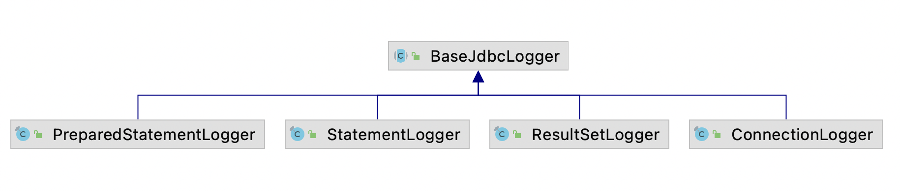
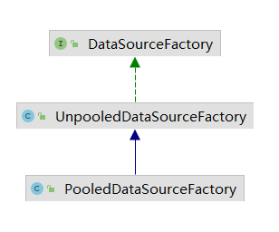

### MyBatis中一些类/接口的作用简介

| 类/接口 | 工厂类 | 实现类 | 作用 |
| --- | --- | --- | --- |
| Reflector | ReflectorFactory |  | 缓存反射操作需要的类的元信息(一个类对应一个Reflector) |
| TypeParameterResolver |  |  | 解析类中的字段、方法返回值、方法参数的类型 |
|  | ObjectFactory(DefaultObjectFactory) |  | 创建指定类型的对象 |
| PropertyTokenizer |  |  | 迭代处理嵌套多层表达式 |
| PropertyNamer |  |  | 完成方法名到属性名的转换(getName -> name, isUsed -> used) |
| PropertyCopier |  |  | 完成相同类型的两个对象的属性值拷贝 |
| MetaClass |  |  | 完成复杂属性表达式的解析，获取指定属性**描述**信息(类级别元信息的封装处理) |
| ObjectWrapper | ObjectWrapperFactory(DefaultObjectWrapperFactory) |  | 查询对象的属性信息，修改属性值(对象级别的元信息封装) |
| MetaObject |  |  | 组合ObjectFactory, MetaClass和ObjectWrapper，完成属性表达式的解析过程，获取修改(get, set, add) |
| TypeHandler |  | BaseTypeHandler | 完成Java类型和Jdbc类型的转换 |
| TypeHandlerRegistry |  |  | 管理众多的类型转换器(注册(根据@MappedTypes @MappedJdbcType两个注解)查找) |
| TypeAliasRegistry |  |  | 别名的注册管理 |
| Log | LogFactory |  | 适配器兼容其他日志模块 |
| BaseJdbcLogger |  |  | 通过动态代理的方式，将Jdbc操作通过指定的日志框架打印出来(执行的sql语句，传入的参数，影响行数...) |
| ClassLoaderWrapper |  |  | 包含多个类加载器 |
| ResolverUtil |  |  | 根据条件查找指定包下的类 |
| VFS |  |  | 查找指定路径下的资源 |
| **DataSource** |  |  | 数据源 |
| UnpooledDataSource | UnpooledDataSourceFactory |  | 每次都会创建一个新连接(Connection) |
| PooledDataSource | PooledDataSourceFactory |  | 用PooledConnection封装真正的Connection，使用动态代理重写close方法; PoolState用List管理多个PooledConnection(空闲还是激活)，看情况创建连接或重用连接 |
| Transaction |  |  | 事务的抽象 |
| MapperRegistry |  |  | Mapper接口技巧对于的代理对象工厂的注册中心 |
| MapperProxy | MapperProxyFactory |  | Mapper的代理类 |
| **MapperMethod** |  |  | 封装Mapper接口中对应方法的信息，execute根据sql类型执行并处理返回值 |
| SqlCommand |  |  | 记录sql语句的名称和类型(insert, update, unknown, flush...) |
| ParamNameResolver |  |  | 处理Mapper接口中定义的方法参数列表 |
| MethodSignature |  |  | 封装Mapper接口中方法的相关信息(返回值是否是Collection, 数组, Map, void, Cursor; 返回值类型；RowBounds和ResultHandler参数的位置；如果返回Map(@MapKey)记录key) |
| Cache |  |  |  |
| CacheKey |  |  | 唯一的确定一个缓存项，用来封装多个影响缓存项的因素  1. MappedStatement的id  2. 指定查询结果集的范围(RowBounds.offset/limit)  3. 查询的sql语句(可能有占位符?)  4. sql语句参数 |
|  |  |  |  |
|  |  |  |  |
|  |  |  |  |
|  |  |  |  |
|  |  |  |  |

