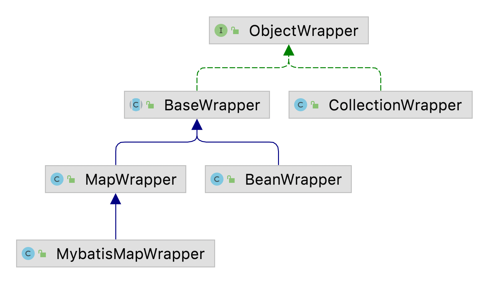

#### mybatis执行器

**SqlSession**(门面):

1. 基本api 增删查改
2. 辅助api 提交关闭会话

#### Executor

sqlSession 和 Executor 是一对一的关系

1. 基本功能： 改 查 维护缓存 事务管理
2. 辅助api: 提交关闭执行器，批处理刷新  
   

BaseExecutor (公共操作 一级缓存 获取连接 (query update 调用(doQuery, doUpdate子类实现)))  
CachingExecutor (二级缓存 装饰器delegate)

SimpleExecutor 简单执行器 (实现doQuery, doUpdate)  
ReuseExecutor 可重用执行器  
BatchExecutor 批处理执行器 只针对修改操作，需要手动刷新

装饰器模式(在不改变原有类结构和继承的情况下，通过包装原对象去扩展一个新功能)

#### 一级缓存

作用域为session  
一级缓存：BaseExecutor  
二级缓存：CachingExecutor

命中场景:  
运行时参数相关:

1. sql 和 参数相同
2. 相同的StatementId (com.mybatis.learn.mapper.BlogMapper.getBlogById)
3. sqlSession必须相同
4. RowBounds 返回行范围必须相同

操作和配置相关

1. 没有手动清空 提交 回滚 sqlSession.clearCache();
2. 未调用flushCache=true的查询
3. 未执行Update(数据一致性问题)
4. 缓存作用域不是Statement(Configuration里面的localCacheScope (Session, Statement(作用于嵌套查询，子查询)))

Mapper ->  SqlSession ->  BaseExecutor(一级缓存 query) ->  StatementHandler

| 动态代理接口 | 会话模板 | 会话拦截器 | 会话工厂 |  
| --- | --- | ---- | --- |
|Mapper | SqlSessionTemplate | SqlSessionInterceptor | SqlSessionFactory |

一级缓存：

1. 会话相关
2. 参数条件相关
3. 修改提交会清空缓存

#### 二级缓存

应用级缓存，可以跨线程使用
****

1. 存储位置
2. 溢出淘汰(LRU)
3. 过期清理
4. 线程安全
5. 命中率统计
6. 序列化

命中场景

1. 会话提交后(autoCommit=true不行，必须commit或close)
2. sql语句，参数相同
3. 相同的Statement
4. RowBounds相同

配置

| 参数 | 作用  |
| --- | --- |
| cacheEnable| 全局缓存开关，默认为true |
| useCache | 当前statement缓存开关，默认为true|
| flushCache | 清除当前缓存空间： 修改true，查询false，**所有对缓存的变更只有在提交之后**|
| <cache> @CacheNameSpace| 声明缓存空间 |
| <cache-ref> @CacheNameSpaceRef | 引用缓存空间(xml+注解) |

xml 和 java类 中的缓存不是同一个命名空间，必须使用<cache namespace="" />

提交之后才能命中缓存  
会话直接是互相隔离的，缓存导致数据可见，不提交就放入缓存(事务回滚)可能会导致脏读

Session 每个会话(SqlSession)都有一个事务缓存管理器(TransactionCacheManager) 用来管理 多个暂存区(TransactionCache)  都指向同一个缓存区(
SynchronizedCache)  
commit之后才会将暂存区的数据移入缓存区

session -> cachingExecutor -> TransactionCacheManager -> 多个暂存区(TransactionCache) -> 缓存区

org.apache.ibatis.cache.Cache.java  
装饰器 + 责任链

| SynchronizedCache | LRUCache | LoggingCache | ScheduledCache | BlockingCache | PerpetualCache |  
| --- | --- | --- | --- | --- | --- |  
| 线程同步 | 记录命中率 | 防溢出 | 过期清理 | 防穿透 | 内存存储 |

sqlSession -> CachingExecutor(二级缓存) -> BaseExecutor(Simple/Reuse/Batch一级缓存) -> 数据库 -> 填充数据到暂存区 先取二级缓存(CacheExecutor)
数据，然后查一级缓存(BaseExecutor)  


clearOnCommit 同一个会话中 查 改 查  
第二次改将clearOnCommit=true，由于没有提交，只是清空了暂存区  
第三次查能查到但是返回null  
commit之后将暂存区同步到缓存区

**StatementHandler**:

`SqlSession -> Executor -> StatementHandler  `  
`      1 ->      1 ->      n`

jdbc处理器，基于jdbc构建statement并设置参数，然后执行sql  
每调用一次会话中的sql，都会有与之对应且唯一的statement实例

1. 声明JdbcStatement 填充参数
2. sql执行  
   jdbc处理器
     
   有三种：Simple/Prepared/Callable StatementHandler  
   执行语句，预编译，设置参数，执行jdbc，结果集映射

| 执行器 | 基础jdbc处理器 | 预处理器 | 参数处理器 | 结果处理器 | 
| --- | --- | --- | --- | --- |
| Executor | BaseStatementHandler(处理公共参数(超时时间，取回行数fetchSize)) | PreparedStatementHandler | ParameterHandler | ResultSetHandler |


参数处理  
java bean -> jdbc参数

`ParamNameResolver`

1. 单个参数 默认不转换，除非设置了@Param
2. 多个参数
    1. 转换成Param1, Param2 -> Map 一直有
    2. 通过@Param中的name属性转换，这样就不会有arg0之类的参数
    3. 基于反射转换成变量名，如果不支持(jdk7)转换成arg0, arg1

ParameterHandler  
将参数封装成ParameterMapping -> TypeHandler设置参数

1. 单个原始类型 直接映射，忽略sql中的引用名称
2. Map类型 基于key映射
3. Object 基于属性名映射，支持嵌套对象属性访问(MetaObject)

**ResultSetHandler**完成主要的结果集映射功能(将**结果集**的行转换成对象) -> 实现类DefaultResultSetHandler  
ResultContext(存放当前行对象，以及解析状态和控制解析数量(可以暂停解析过程))  
ResultHandler(处理存入**解析结果bean**)  


mybatis映射体系(反射实现)  



#### 工具类

**MetaObject**

1. 查找属性， 忽略大小写，支持驼峰，支持**子属性**
2. 获取属性值
    1. 基于点获取子属性 user.name
    2. 基于索引获取列表值 users[1].name
    3. 基于key获取map值 user[name]
3. 设置属性
    1. 可设置子属性值
    2. 支持自动创建子属性(必须带有无参构造函数，不能有集合(集合需要手动new))

自动映射 手动映射 分开处理  
如果有嵌套子查询(走缓存)也需要处理

**BeanWrapper**(MetaObject的底层实现，只能设置**当前对象**的属性，不能设置属性的属性(BaseWrapper))

1. 查找属性
2. 获取属性值
3. 设置属性
4. 创建属性

**MetaClass**

基于属性名获取set, get方法，支持**子属性**获取

**Reflector**

基于属性名获取set, get方法，属性类别，只支持**当前对象**属性获取

`MetaObject + BeanWrapper `设置获取对象的属性

`MetaClass + Reflector` 设置获取Class对象的属性

**手动结果集映射(Bean <--> Row)**

ResultMap
ResultMapping

1. constructor
2. id
3. result
4. association(一对一)
5. collection(一对多)
    1. 复合映射
       ```html
       <resultMap id="blogMap" type="blog">
         <id></id>
         <result></result>
         <association property="comments" column="comment_id">
           <id column="id" property="id"></id>
           <result column="body" property="body"></result>
         </association>
       </resultMap>
       ```
       
    2. 嵌套查询
       ```html
       <resultMap id="blogMap" type="blog">
         <id></id>
         <result></result>
         <association property="comments" column="comment_id" select="selectCommentByBlogId">
         </association>
       </resultMap>
       <select id="selectCommentByBlogId" />
       ```
       
    3. 外部映射
       ```html
       <resultMap id="blogMap" type="blog">
         <id></id>
         <result></result>
         <association property="comments" resultMap="commentMap">
         </association>
       </resultMap>
       <resultMap id="commentMap" type="comment">
         <id column="id" property="id"></id>
         <result column="body" property="body"></result>
       </resultMap>
       ```

**自动映射**  
列名 <----> 属性名

1. 列名和属性名同时存在(忽略大小写)
2. 当前列未手动设置映射
3. 属性类别存在TypeHandler
4. 开启autoMapping(默认开启)

`UmMappedColumnAutoMapping`

#### 嵌套子查询

```html
<resultMap id="blogMap" type="blog">
    <result column="title" property="title"></result>
    <association property="author" column="authorId" select="selectUserById"></association>
    <!-- 如果传递多个column参数可以用 column="blogId=id,name=name" -->
    <collection property="comments" column="blogId=id" select="selectCommentsByBlogId"></collection>
</resultMap>
<select id="selectUserById" resultType="user">
    select * from users where id=#{userId}
</select>
<select id="selectCommentsByBlogId" resultType="comment">
    select * from comment where blogId=#{blogId}
</select>
```

**循环依赖流程**

`DefaultResultSetHandler类`

1. 填充属性 (填充属性是触发子查询 `queryStack` 手动填充是会触发懒加载)
2. 获取嵌套查询值 `getNestedQueryMappingValue`
3. 执行准备
    1. 获取 `MappedStatement` `getMappedStatement`
    2. 准备参数 `prepareParameterForNestedQuery`
    3. 获取动态sql  `getBoundSql`
    4. 创建缓存`createCacheKey`

4. 是否命中一级缓存`isCached` ->  延迟装载`deferLoad`(解决循环依赖，放入延迟加载的列表中等**主查询结束之后**(`queryStack=0`)填充`ResultObject`对象的值，判断是否需要清空缓存) 
5. 是否懒加载 `isLazy` ->  懒加载(动态代理) 
6. 实时加载 `loadResult`

**懒加载**

用动态代理bean实现(一次操作)

| 装载器 | 执行器 | 数据库 |
| --- | --- | --- |
| getXXX -> ResultLoader | Executor一次操作 | 数据库 |

调用set方法修改bean的属性，懒加载会被移除 

```java
User user = sqlSession.selectOne("selectUserById", id);
user.setName("a"); // 这里会修改查询出来的bean对象的属性值
System.out.println(user);
```

只有java的原生序列化，反序列化之后才进行加载(会懒加载)(序列化需要设置`configurationFactory`(内部类的标识:`外部类$内部类`))

```java
ByteArrayOutputStream baos = new ByteArrayOutputStream();
ObjectOuptputStream oos = new ObjectOutputStream(baos);
oos.writeObj(bean);
// oos.toByteArray(); 将反序列化结果写入文件或其他
```

sqlSession 多次操作

填充属性 获取嵌套查询值

**懒加载内部实现**

懒加载实现

`Bean$proxy ->  ResultLoader ->  Executor ->  数据库` Bean对象被动态代理了(里面放了额外的属性`MethodHandler`)

1. `MethodHandler` 处理方法代理逻辑  
2. `ResultLoaderMap` 存储待加载的属性(记载之前，将要加载的属性移除)  
3. `LoadPair` 准备加载环境，在反序列化并触发懒加载时，需要重写构建`Configuration`以及`ResultLoader`加载器与相关参数  
4. `ResultLoader` 装载器，执行查询并获取结果。跨线程或原执行器关闭(**反序列化后**执行懒加载时用`CloseExecutor`标识执行器已经关闭了，需要重写创建一个)，将会构造一个新的执行器  

```java
// 这几个方法会触发懒加载，调试debug的时候会触发懒加载
protected Set<String> lazyLoadTriggerMethods = new HashSet<String>(Arrays.asList(new String[] { "equals", "clone", "hashCode", "toString" }));
```

#### 联合查询 嵌套查询


#### 动态sql

每次执行sql时，基于预先构建的脚本和参数动态的构建可执行语句

if， foeach， choose, when, otherwise， trim, where, set， bind

ognl表达式: 访问对象属性，调用方法等

xml -> SqlSource -> BoundSql

SqlSource, DynamicSqlSource(动态编译), RawSqlSource(静态编译), ProviderSqlSource(freemarker),  StaticSqlSource(存储已编译的SqlSource)


