## mybatis技术内幕

### 1. 入门

#### 1.1 ORM简介

传统jdbc连接数据库：

1. 注册数据库驱动，明确指定url，用户名，密码等
2. 通过`DriverManager`获取连接`Connection`
3. 通过连接而创建`Statenment`语句
4. 通过`Statement`对象执行`sq`l语句，得到`ResultSet`
5. 通过`ResultSet`读取数据，将数据转换成`Bean`
6. 关闭`ResultSet， Statement， Connection`等，释放资源

ORM(Object Relational Mapping)对象关系映射

#### 1.2 持久层框架

Hibernate，jpa，mybatis

#### 1.3 实例

程序先加载mybatis-config.xml配置文件，根据配置文件创建SqlSessionFactory对象，通过SSF对象创建Session对象，SqlSession中定义了执行sql的各种方法，通过SqlSession对象执行sql语句，完成数据库操作，最后通过SqlSession对象提交提交事务，关闭资源。

```java
SqlSessionFactory factory = new SqlSessionFactoryBuilder()
      .build(Resources.getResourceAsReader("mybatis-config.xml"));
SqlSession session = factory.openSession();
Map<String, Object> parameters = new HashMap<>();
parameters.put("id", "1");
Blog blog = session.selectOne("com.mybatis.learn.mapper.BlogMapper", parameters);
System.out.println("blog = " + blog);
session.close();
```

#### 1.4 mybais的架构

1. **接口层**

    sqlSession

2. **核心处理层** 

   配置解析，参数映射，sql解析，sql执行，结果集映射，插件

3. **基础支持层** 

   数据源模块，事务管理模块，缓存模块，Binding模块，反射模块，类型转换，日志模块，资源加载，解析器模块

mybatis的整体架构


一条sql语句的大致执行过程

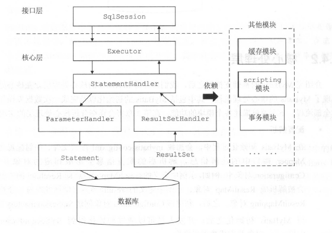


### 2. 基础支持层

#### 2.1 解析器模块  
三种解析方式：DOM, SAX, StAX

相关类(org.mybatis.ibatis.parsing)：`XPathParser XNode TokenHandler PropertyParser`
`GenericTokenParser`字占位符解析器：按顺序查找openToken和closeToken，解析得到占位符的字面量，交给`TokenHandler`处理，将解析结果 重新拼装成字符串并返回
不仅可以用于默认值解析，也可以用于动态sql语句的解析

TokenHandler有四个实现

1. VariableTokenHandler(PropertyParser的私有静态内部类)
2. ParameterMappingTokenHandler
3. DynamicCheckerTokenParser
4. BindingTokenParser

#### 2.2 反射工具

**1. Reflector**(缓存反射操作需要使用的**类的元信息**)
JavaBean:

​	字段: 定义的成员变量 

​	属性: 通过getter/setter得到的(只与类中的方法有关，与是否存在成员变量没有关系)  

定义的字段，在构造函数中初始化：

 1. 可读/写属性的名称集合 `String[]`
 2. 属性相应的`setter/getter`方法 `Map<String, Invoker>` (`key`: 属性名称, `value`: 对应`setter/getter`方法对应`Method`对象的封装)
 3. 属性相应`setter/getter`方法的返回值类型 `Map<String, Class<?>>` (`key`: 属性名, `value`: `setter/getter`方法的返回值类型)
 4. 默认的构造方法 `Constructor<?>`
 5. 所有属性名称的集合

​       `Map<String, Invoker> getMethods = new HashMap<>();`
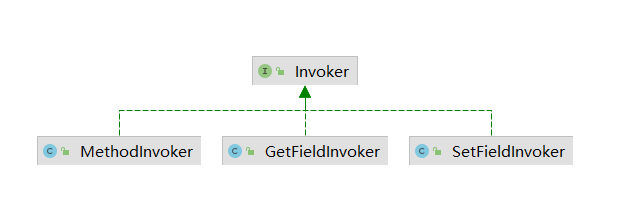
Invoker接口中的两个方法

1. `invoke(Object target, Object[] args) ` 方法用于获取指定字段的值(getXxx)或执行指定的方法(`Method.invoke()`)  
2. `getType()` 返回属性相应的类型

填充上述属性过程：

 1. 查找默认的构造方法(无参的)，通过反射遍历所有的构造函数
 2. `addGetMethods(clazz)`处理`clazz`中的`getter`方法，填充`getMethods`和`getTypes`集合
     1. `getClassMethods(clazz)`获取当前类及其父类中定义的所有方法的唯一签名(返回值类型#方法名称:参数类型列表(`java.lang.String#getSingnature:java.lang.reflect.Method`)) 和 对应的`Method`对象
     2. 从上面方法中返回的数组中查找该类中定义的所有`getter`方法(暂时存放到`conflictingGetters`集合中)
     3. `resolveGetterConflicts` 子类覆盖父类的`getter`方法且返回值发生变化时，处理冲突(同时一个方法父类返回`List`，子类返回`ArrayList`时，选择子类的)
 5. `addFields(clazz)` 处理类中定义的所有字段，将处理后的字段信息添加到集合中(`final static can only be set by the classloader`)
    同时提供了多个`get*()`方法用于读取上述集合中记录的元信息

`ReflectorFactory`接口 实现对`Reflector`对象的创建和缓存

`DefaultReflectorFactory `是唯一实现

使用`ConcurrentHashMap<Class, Reflector>`完成对`Reflector`对象的缓存；`findForClass`为指定`class`对象创建`Reflector`对象放入上面的`Map`中

2. **TypeParameterResolver** 
   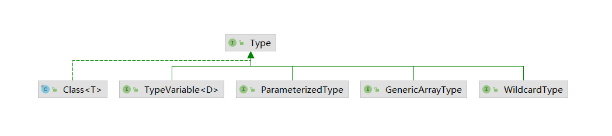 
   `java.lang.reflect.Type`接口:
   
    1. 子接口: `ParameterizedType, GenericArrayType, TypeVariable, WildcardType`
        1. `ParameterizedType`表示参数化类型 `List<String>` 
        
           `Type getRawType` 返回参数化类型中的原始类型`List `
        
           `Type[] getActualTypeArguments` 返回类型变量或实际类型列表 `String` 
        
           `Type getOwnerType` 返回类型所所属类型 `Map<K,V>`接口是`Map.Entry<K, V>`接口的所有者
        
        2. `TypeVariable` 类型变量，反应在JVM编译该泛型前的信息 `List<T>` `T`就是类型变量，编译时需要被转换成具体类型才能正常使用 
        
           `Type[] getBounds` 获取类型变量的上界，未明确声明则为`Object` `Test<T extends User> -> User` 
        
           `D getGenericDeclaration` 获取声明改类型变量的原始类型 `class Test<T extends User>` -> `Test`
        
           `String getName` 获取源码中定义的名称 `T`
        
        3. `GenericArrayType`表示数组类型且组成元素是`ParameterizedType` 或 `TypeVariable`
        
           `Type getGenericComponentType` 返回数组的组成元素
        
        4. `WildcardType` 通配符泛型(`<? extends Number>, <? super Integer>`) 
        
           `Type[] getUpperBounds` 返回泛型变量上界
        
           `Type[] getLowerBounds` 返回泛型变量下界
    2. 实现类: `Class`
        1. `Class`: 它表示的是原始类型。`Class` 类的对象表示JVM中的一个类或接口，每个Java 类在JVM里都表现为一个Class 对象。在程序中可以通过`类名.class` 、`对象.getClass()`
           或是`Class.forName(类名)`等方式获取Class。**数组也被映射为Class对象，所有元素类型相同且维数相同的数组都共享同一个Class对象**
   
   `TypeParameterResolver` 提供静态方法解析指定类中的**字段**，**方法返回值**或**方法参数类型**
   
   存在复杂继承关系以及泛型定义时，该类帮助解析字段、方法参数、或方法返回值的类型
   
   `resolveFieldType()` 解析字段类型
   
   **2. ObjectFactory** 
   
   通过多个重载的`create`方法创建指定类型的对象
   
   该接口提供的方法如下：
   
    1. 设置配置信息(`properties`)
   
    2. 通过无参构造函数创建指定对象
   
    3. 根据参数列表选择指定的构造函数创建对象
   
    4. 检测指定类型是否为集合(用来处理`java.util.Collection`及其子类)
       
       `DefaultObjectFactory`是唯一实现
       
       `instantiateClass`根据传入的参数列表选择合适的构造函数实例化对象
   
   **3. Property**工具类
   
   1. `PropertyTokenizer `Iterable 对传入的表达式进行解析 (`orders[0].items[0].name`)
      当前表达式，当前表达式的索引名，索引下标，子表达式
   2. `PropertyNamer`完成方法名到属性名的转换(将方法名开头的`is, get, set`去掉并将首字母小写)
   3. `PropertyCopier`完成相同类型的两个对象之间的属性值拷贝(包括父类中定义的字段)
   
   **4. MetaClass** 
   
   `MetaClass` 构造函数是私有的，通过静态方法(`forClass`)创建 通过组合`Reflector`和`PropertyTokenizer`完成对**复杂属性表达式的解析**，并获取指定属性描述信息
   
   `findProperty hasGetter hasSetter`
   
   封装一个`Reflector`对象(通过`ReflectorFactory`创建), 类级别的元信息封装和处理
   
   **5. ObjectWrapper**
   
   **对象级别**的元信息处理：抽象了对象的属性信息，定义一系列查询和更新对象属性信息的方法
   
   `get(PropertyTokenizer)` // 如果封装的是普通对象，调用相应属性对应的getter方法；如果是集合，获取指定key或下标对应的`value` (`set(PropertyTokenizer, Object value)`
   设置值)
   
   `findProperty(String, boolean)` 查找属性表达式指定的属性 (是否忽略下划线)
   
   `getGetter/SetterNames` 查找可写/读属性的名称集合  
   
   `getGetter/SetterType` 解析属性表达式指定属性的getter的参数类型/setter方法的返回值类型
   
   `hasGetter/Setter` 判断指定属性是否有getter/setter方法
   
   `instantiatePropertyValue` 为属性表达式的指定属性创建相应的MetaObject对象
   
   `isCollection add addAll` (封装对象是否是Collection集合，向集合中添加对象)
   
   `ObjectWrapperFactory`(实现类`DefaultObjectWrapperFactory`不可用，需要在myabtis-config.xml中自己实现类进行扩展)负责创建`ObjectWrapper`
   
   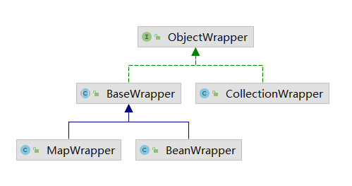  
   `BaseWrapper`(处理集合)
   
    1. `resolveCollection` 解析属性表达式并获取指定的属性
    2. `get/setCollectionValue` 解析属性表达式的索引信息，然后获取/设置对应项
   
   `BeanWrapper`(处理bean对象)
   
   `MapWrapper`(处理`Map<String, Object>`类型的对象)
   
   `CollectionWrapper`(不可用)
   
   **6. MetaObject**
   
   构造函数会根据传入的原始对象类型和`ObjectFactory`工厂的实现，创建相应的`ObjectWrapper`对象
   
   完成**属性表达式的解析**过程(例如:order[0].id)(MetaObject -> BeaWrapper -> MetaObject等递归)

#### 2.3 类型转换  
完成**Java类型 和 JDBC类型**的互相转换

`JdbcType`(枚举类型) -> `JDBC`中的数据类型(`TYPE_CODE`记录改类型在`java.sql.Types`中的常量编码)，并且通过静态集合`HashMap<TYPE_CODE, JdbcType>`记录常量编码和JdbcType之间的对应关系

**1. TypeHandler类型转换器**

用于完成单个参数以及单个列值的类型转换，如果存在多列值转换成一个java对象，应优先考虑`<resultMap>定义映射规则 `

所有的类型转换器全部继承`TypeHandler`

1. `setParameter` 通过PreparedStatement为sql语句绑定参数时，将数据从JdbcType类型转换成Java类型
2. `getResult` (多个重载)从ResultSet中获取结果时，将数据从Java类型转换成JdbcType类型

用户如果想自定义使用`BaseTypeHandler` ，实现了`TypeHandler`接口并继承**TypeReference**抽象类，对于数据非空处理都交给了子类

**2. TypeHandlerRegistry**

`TypeHandlerRegistry` **管理**众多的`TypeHandler`，`MyBaits`初始化时，会为所有已知的`TypeHandler`创建对象，注册在其中，该对象中的核心字段功能: 

1. `JDBC_TYPE_HANDLER_MAP`: 记录`JdbcType`与`TypeHandler`的对应关系(用于从结果集读取数据时，将数据从Jdbc类型转换成Java类型 `char, varchar -> java.lang.String`)

2. `TYPE_HANDLER_MAP`: 记录`Java`类型向指定`JdbcType`转换时，需要使用的`TypeHandler`对象(一对多 `java.lang.String -> char, varchar`)

3. `ALL_TYPE_HANDLER_MAP`: 记录全部`TypeHandler`的类型 和 `TypeHandler`对象

4. `NULL_TYPE_HANDLER_MAP`: 一个空`TypeHandler`集合标识

   

1. 注册`TypeHandler`

   通过读取(`@MappedJdbcTypes(JdbcType.VARCHAR), @MappedTypes({Date.class})`)两个注解的内容，注册进去 或 扫描包下的类注册进去(`TypeHandlerRegistry`的构造函数会将常用的类型处理器注册进去)

2. 查找TypeHandler

   根据指定的`JavaType` 和` JdbcType`查找相应的`TypeHandler`对象

**3. TypeAliasRegistry**

为类添加别名

`TypeAliasRegistry` 完成别名注册和管理功能(管理别名和java类型之间的关系`Map<String, Class<?>>`)

`registerAlias(String, Class)` key转小写放入

`registerAliases(packageName, Class)` 扫描指定包下的所有类，为指定类的子类添加别名

`registerAlias(Class)` 尝试读取@Alias注解

#### 2.4 日志模块

设计模式六大原则：

1. 单一职责原则
2. 里氏替换原则
3. 依赖倒置原则
4. 接口隔离原则
5. 迪米塔法则
6. **开放封闭原则**  程序要对扩展开放，对修改关闭

**适配器**模式

需要适配的类(真正的业务逻辑) <--> 适配器 <--> 目标接口(调用者使用)

`com.apache.ibatis.logging.Log` 定义日志模块的功能

`LogFactory` 创建对应的日志组件适配器

**代理**模式 与 JDK动态代理 

代理模式可以控制对真正对象的访问，或在执行业务处理的前后进行相关的预处理和后置处理，还可以用于实现延迟加载(当系统真正使用数据时，再调用 代理对象完成数据库的查询并返回数据)功能

静态代理：编译阶段就要创建代理类

JDK动态代理：`InvocationHandler`接口，动态创建代理类并通过类加载器加载，然后在创建代理对象时将`InvokeHandler`对象作为构造参数传入，当调用代理对象时 ，会调用`InvokerHandler.invoke()`
方法，并最终调用真正的业务对象的相应方法。

```text
Proxy.newProxyInstance(ClassLoader loader, Class<?> interfaces, InvocationHandler h)
	1. loader 加载动态生成的代理类的类加载器
	2. interfaces 业务类实现的接口
	3. h 实现InvocationHandler的对象

业务逻辑(java.reflect.Proxy.newProxyInstance方法中):
 1. 获取代理类的Class getProxyClass0(loader, interfaces)
   1. 限制接口数量 < 65536
   2. 如果指定的类加载器中已经创建了实现指定接口的代理类，就从缓存(WeakCache<ClassLoader, Class<?>[], Class<?>> proxyClassCache)中查找；否则通过ProxyClassFactory创建实现指定接口的代理类
   3. WeakCache.get先从缓存中查找代理类，如果找不到创建Factory(WeakCache的内部类)对象调用get方法获取代理类，Factory.get会调用ProxyClassFactory.apply(Proxy类中，是一个BiFunction<T, U, R>(提供两个参数，返回一个结果))创建并加载代理类(包名+代理类名称前缀+编号)
   4. apply方法先检测代理类需要实现的接口集合，确定代理类的名称，创建代理类并写入文件，最后加载代理类返回对应的Class对象用于后续实例化代理类对象
 2. 获取代理类的构造方法
 3. 创建代理对象
```

**JDBC调试**
`com.apache.ibatis.logging.jdbc`包通过动态代理的方式将`JDBC`操作通过指定的日志框架打印出来

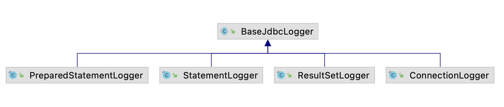
`BaseJdbcLogger` 抽象类：记录绑定sql参数相关的set*方法名称 和 执行sql语句相关的方法名称

`ConnectionLogger` 封装`Connection`对象同时为其封装的`Connection`对象创建相应的代理对象(为`prepareStatement, prepareCall, createStatement` 方法提供代理)

`PreparedStatementLogger` 封`PreparedStatement`对象，并为其创建相应的代理对象(为各种`set*, execute*`方法提供代理 )

`StatementLogger`与`PreparedStatementLogger`类似

`ResultLogger` 封装`ResultSet`对象并为其创建代理对象 (展示查询结果，代理`next`方法)

#### 2.5 资源加载

`org.apache.ibatis.io`包封装`ClassLoader`以及读取资源文件的API

```text
java中的类加载器(双亲委派模型)
1. Bootstrap classloader 加载jdk自带的rt.jar
2. Extention classloader 加载jre/lib/ext目录下的类 和 java.net.dirs系统属性指定的目录下的类
3. System classloader 加载classpath中的类文件
```

`ClassLoaderWrapper`: 是`ClassLoader`包装器，确保返回给系统的是正确的加载器(按照指定的顺序依次检测封装的`ClassLoader`对象，从中选择一个可用的完成相关功能)

包含 系统指定的默认加载 和 系统类(应用程序类)加载器

```text
类加载器顺序:
1. 参数指定的类加载器
2. 系统值的默认加载器
3. 当前线程绑定的类加载器
4. 加载当前类使用的类加载器
5. 系统类加载器
```

`Resources` 调用封装的`ClassLoaderWrapper`返回数据

**ResolverUtil** 根据指定条件查找指定包下的类

条件`Test`(只有一个`matches<Class>`方法

`IsA`(检测类是否继承类指定类或接口)

`AnnotatedWith`(检测类是否添加了指定注解))，类中封装了当前使用的类加载器(默认时当前线程上下文绑定的`ClassLoader(Thread.currentThread().getContextClassLoader()))`

**单例模式**(`volatile`禁止指令重排序；第一次访问类中的静态字段时，会触发类的加载)

**VFS** 虚拟文件系统 查找指定路径下的资源，包括jar包

#### 2.6 DataSource  

实现`javax.sql.DataSource`接口

`PooledDataSource` 和 `UnpooledDataSource` 使用工厂创建

工厂方法模式：添加新产品时，只需要添加对应的工厂实现类，而不必修改已有的代码。符合开放封闭原则。同时工厂方法向调用者隐藏具体产品的实例化细节 调用者只需要了解工厂接口和产品接口，面向接口编程。

但是新增新产品实现类时，还要提供一个与之对应的工厂实现类，新增的类是成对实现的。

`org.apache.ibatis.datasource.DataSourceFactory` 工厂接口(配置属性，获取数据源)

`UnpooledDataSourceFactory`, `PooledDataSourceFactory `两个工厂接口实现类

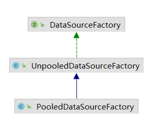
`javax.sql.DataSource` 产品接口
`UnpooledDataSource`, `PooledDataSource `两个产品类

1. `UnpooledDataSource `每次`getConnection`都会获取一个新的连接

2. `PooledDataSource`
   使用`PooledConnection`封装代理(Jdk动态代理，对`close`方法进行代理，使用线程池 调用代理对象的`close`方法时，并未真正关闭数据库连接，而是将`PooledConnection`对象归还给数据库，供之后重用)
   
   真正的`Connection`对象是由封装的`UnpooledDataSource`创建的
   `PolledDataSource`封装数据库连接池的统计信息
   使用`PoolState`管理`PooledConnection`对象的状态，分别用List存储 空闲和活跃状态的连接，并存储一些关于连接池的统计字段
   `PooledDataSource.getConnection`的时候会获取`PooledConnection`对象，然后`getProxyConnection`获取数据库连接的代理对象
   
   修改数据库配置的时候，会清空所有的连接

#### 2.7 Transaction

`org.apache.ibatis.transaction.Transaction` 接口的功能：

1. 获取数据库连接 
2. 提交事务 
3. 回滚事务 
4. 关闭数据库连接 
5. 获取事务超时时间

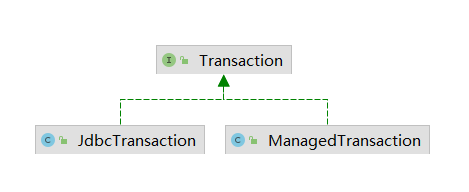
`JdbcTransaction JdbcTransactionFactory` 依赖`Jdbc Connection`控制事务的提交和回滚

包含如下字段： 1. 数据库连接 2. 数据库连接所属DataSource 3. 事务隔离级别 4. 是否自动提交

`ManagedTransaction ManagedTransactionFactory` 依赖容器控制事务的提交回滚

`TransactionFactory` 在指定连接上创建事务对象 或 从指定数据源中获取数据库连接，在连接上创建事务对象

#### 2.8 Binding模块

**MapperRegistry MapperProxyFactory**

`MapperRegistry` 是Mapper接口及其对应的代理对象工厂的注册中心 记录`Mapper`接口 和 `MapperProxyFactory`之间的关系

在`Mybatis`初始化时，会读取配置文件以及`Mapper`接口中的注解信息填充到`Map<Class<?>, MapperProxyFactory<?>> knownMappers`里面，
`key`是`Mapper`接口对应的`Class`对象，`value`是`MapperProxyFactory`工厂对象，为`Mapper`接口创建代理对象

`session.getMapper(XXXMapper.class)`获取的是通过jdk动态代理生成的代理对象

`MapperProxyFactory`负责创建实现了`MapperInterface`接口的代理对象

**MapperProxy**

实现类InvocationHandler接口，为接口(`@Mapper`)创建代理对象，并进行缓存

**MapperMethod(记录sql语句信息)**

封装Mapper接口中对应方法的信息，以及对应的sql语句信息。完成参数转换和sqk语句的执行功能。不记录任何状态相关的信息，可以在多个代理对象之间共享

一个连接Mapper接口和映射配置文件中定义的sql语句的**桥梁**

核心方法`execute`根据sql语句类型(`insert, update...`)调用`sqlSession`完成数据库操作并处理返回值(`Bean, Map, List, [], void...`)

```
MapperMethod.rowCountResult -> 处理int类型返回值
MapperMethod.executeWIthResultHandler -> 使用ResultHandler处理查询结果集(必须指定ResultMap或ResultType)
MapperMethod.executeForMany -> 处理返回值是Collection或数组类型及其子类(convertToDeclaredCollection进行转换)
MapperMethod.executeForMap -> 处理返回值是Map类型
MapperMethod.executeForCursor -> 处理返回值是Cursor类型
```

**SqlCommand**(内部类，记录sql语句的名称和类型)

1. name记录sql语句的名称(mapper接口名.方法名)
2. type记录sql语句类型(枚举`unknown, select, insert, update, delete, flush`)

**MethodSignature**(内部类)

封装`Mapper`接口中定义的方法的相关信息

通过多个`boolean`类型变量记录返回值是否为`Collection, Map, void, Cursor`; 

返回值类型

如果返回`map`，记录`key`的名字

记录`RowBounds, ResultHandler`的位置

记录该方法对应的`ParamNameResolver`对象

**ParamNameResolver**

`MethodSignature`中使用`PraamNameResolver`处理`Mapper`接口中定义的方法的参数列表

`SortedMap<Integer, String> names` 记录参数列表中的**位置索引**和**参数名称(如果没有用@Param声明就记录参数索引)**之间的对应关系(第key个位置是第value个参数)

RowBounds 和 ResultHandler不会被记录

将实参与对应的名称进行关联 `Map<String, Object> param {{0, val1}, {param1, val2}, {1, val2}, {param2, val2}}`

```text
aMethod(@Param("M") int a, @Param("N") int b) -> {{0, "M"}, {1, "N"}}
aMethod(int a, int b) -> {{0, "0"}, {1, "1"}}
aMethod(int a, RowBounds rb, int b) -> {{0, "0"}, {2, "1"}}
```

#### 2.9 缓存 

`org.apache.ibatis.cache.Cache`接口  

**装饰器模式**: 动态的为对象添加功能，基于组合的方式实现

Cache接口中定义的功能：

1. 缓存对象id
2. 向缓存中加数据
3. 根据指定key查找缓存项
4. 删除key对应的缓存项
5. 清空缓存
6. 获取缓存个数

Cache中唯一确定一个缓存项是通过缓存项中的key, 使用CacheKey表示(封装多个影响缓存项的因素)

`PerpetualCache`提供了基本实现，被装饰器装饰的原始对象，其他高级功能通过装饰器添加到该类上面

通过`HashMap`记录缓存项

`org.apache.ibatis.cache.decorators` 提供各种装饰器，在PerpetualCache基础上提供额外功能
通过组合完成特定的需求

1. `BlockingCache`: 保证只有一个线程到数据库中**查找**指定key对应的数据

   每个key都有一个ReentrantLock；线程A在BlockingCache中未查找到keyA对应的缓存项时，线程A会获取keyA对应的锁(通过一个Map记录)，后续线程在查找keyA时会发生阻塞

   线程A从数据库中查到keyA对应的结果后，将结果对象放入BlockingCache里面，释放锁，唤醒阻塞在该锁上的线程

   其他线程可以从BlockingCache中获取数据，不需要重新访问数据库

2. `FifoCache LruCache`: 按照一定的规则清理缓存

   FifoCache 向缓存中添加数据(Deque LinkedList)时，如果缓存项的个数达到上限，会将缓存中最早进入的缓存项删除

   LruCache 清空最近最少使用的缓存项(LinkedListHashMap)

3. `SoftCache WeakCache`

4. `ScheduledCache `周期性清理缓存(默认一小时，清空所有缓存项)

5. `LoggingCache `提供日志功能 记录命中次数和访问次数，统计命中率

6. `SynchronizedCache `用synchronized为Cache添加同步功能

----

以上从缓存中获取同一key对应的对象都是**同一个**，任意一个线程修改后都会影响到其他线程获取的对象

----

7. `SerializedCache `提供将value对象序列化功能，将序列化后的byte[]作为value存储缓存，取出时反序列化，所以每次获取到的都是新的对象

**CacheKey** 

唯一确定一个缓存项

可以添加多个对象(存入updateList)，共同决定两个key是否相同

1. **`MapperStatement`的id**
2. 指定查询**结果集的范围** `RowBounds.offset RowBounds.limit`
3. 查询所使用的**sql语句**，`boundSql.getSql()`返回的sql语句，可能包含?占位符
4. 用户传递给上述sql的实际**参数值**

### 3. 核心处理层

#### 3.1 MyBatis初始化

mybatis的初始化工作

1. 读取 mybatis-config.xml 配置文件
2.  XxxMapper.xml文件
3. 加载配置文件中指定的类，处理类中的注解Annotation，创建一些配置对象

建造者(生成器)模式: 将复杂对象的构建过程和表示分离，同样地构建过程可以创建不同的表示

BaseBuilder 接口 定义构造者构造产品对象的各部分行为
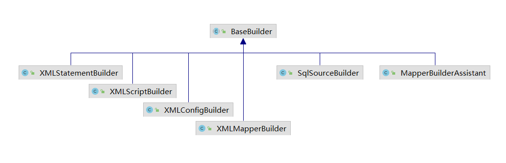 
初始化入口 `SqlSessionFactoryBuilder.build()` 创建 `XMLConfigBuilder `解析`mybatis-config.xml`配置文件  

`org.apache.ibatis.session.Configuration` 初始化过程中创建且全局唯一，MyBatis初始化的核心对象
`XMLConfigBuilder `负责解析`mybatis-config.xml`配置文件

BaseBuilder中三个字段 

```
configuration
typeAliasRegistery
typeHandlerRegistery

一些枚举类型：
JdbcType: jdbc类型
ResultSetType: 结果集类型(FORWARD_ONLY, SCROLL_INSENSITIVE, SCROLL_SENSITIVE)
ParameterMode: 存储过程的参数类型(in, out, inout)
```

**XMLConfigBuilder** 

负责解析映射配置文件(mybatis-config.xml)，依次解析如下元素

```
properties, settings, typeAliases, typeHandlers, objectFactory, objectWrapperFactory, reflectorFactory, plugins, environments, databaseIdProvider, mappers
```

**XMLMapperBuilder**

解析映射配置文件，依次解析如下元素

```text
cache-ref cache parameterMap resultMap sql select|insert|update|delete
```

解析`cache cache-ref`如下元素

```
type eviction flushInterval size readOnly blocking
```

`MapperBuilderAssistant `负责创建Cache对象，添加到`Configuration.caches(StrictMap<namespace, cache>)`中

`Ambiguity `存在二义性的键值对

`CacheBuilder `里面存储了缓存的各项配置，使用装饰器建造Cache

`<cache-ref>` 通过`CacheRefResolver`解析，存储共用的两个namespace

解析resultMap(定义结果集和结果对象之间的映射规则)

ResultMap 每一个<resultMap>标签被解析成一个`ResultMap`

`ResultMapping` 记录结果集中的一列和JavaBean中的一个属性之间的映射关系

(同时还记录了`column, property, javaType, jdbcType, typeHandler`等)

**XMLStatementBuilder** 负责解析sql节点语句

`SqlSource `表示映射文件 或 注解中定义的sql语句(可能包含动态sql，占位符)

`getBoundSql(args)` 根据映射文件或注解的sql + 传入的参数返回可执行的sql

`MappedStatement `表示映射文件中定义的sql节点(包含SqlSource对应一条sql语句)

解析`include sql`

XMLIncludeTransformer 解析sql语句中的<include>标签(将<include>标签替换成<sql>中定义的片段，并将其中的${xxx}占位符替换成真实的参数)

解析`selectKey`(处理主键自增问题)

将<include>和<selectKey>节点解析并删除掉

解析sql节点，添加到`Configuration.mappedStatements`集合中保存

**绑定Mapper接口**

每个映射文件的命名空间可以绑定一个`Mapper`接口，并注册到`MapperRegistry`中

`XMLMapperBuilder.bindMapperForNamespace`方法 完成映射文件和对于`Mapper`接口的绑定

解析配置文件是按照文件从头到尾按顺序解析的，如果再解析某一个节点时，引用到了定义在之后的节点，会抛出`IncompleteElementException`

根据抛出异常的节点不同放到不同的集合(`incomplete*`使用`parsePending*`方法解析)中，最后还会解析一次

#### 3.2 SqlNode SqlSource

映射配置文件中的sql节点(`insert|update|delete|select`)会被解析成`MappedStatement`

sql语句被解析成`SqlSource`对象(其中定义动态sql节点，文本节点，封装包含占位符的sql语句和绑定的实参)，通过解析得到BoundSql对象

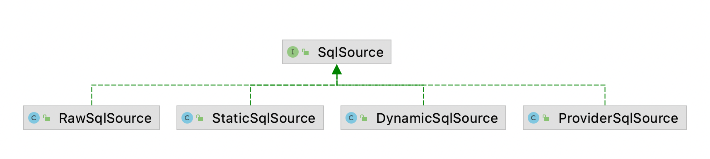  **RawSqlSource**: 负责处理静态语句

**DynamicSqlSource**: 负责处理动态sql语句，封装的sql需要进行一系列的解析，才能形成数据库可执行的sql

上面两种都会将处理好的sql语句封装成`StaticSqlSource`返回

**StaticSqlSource**: 记录的sql可能包含占位符，但是可以直接交给数据库执行

采用组合的设计模式处理动态sql节点，解析成SqlNode，形成树形结构

**OGNL**(`object graphic navigation language` 对象图导航语言)表达式

存取java对象树中的属性，调用java对象树中的方法等

**DynamicContext**

记录解析动态sql语句之后产生的sql语句片段，一个用于记录动态sql语句解析结果的容器，当sql中的所有节点解析完成后(`appendSql`)，可以从中获取(`getSql`)一条动态生成的sql语句

同时也需要记录用户传入的参数(`ContextMap`)，用来替换`#{}`占位符

**SqlNode**

解析对应的动态sql节点，生成一条完整的sql语句

1. `StaticTextSqlNode`: 记录非动态sql语句，可以直接追加到sql上面
2. `MixedSqlNode`: 使用List<SqlNode>记录子节点，循环将集合中的子节点组合到sql上面
3. `TextSqlNode`: 包含占位符的动态sql节点，会将占位符替换成用户传递的实际参数，然后追加到sql上面
4. `IfSqlNode`: if节点，检测test表达式的值(ognl表达式)，根据结果决定是否添加到sql上面
5. `TrimSqlNode, WhereSqlNode, SetSqlNode`: 根据子节点的解析结果，添加或删除前缀后缀
6. `ForeachSqlNode`: 处理前后缀，遍历集合添加分隔符，将`#{item} -> #{__frc_item_0}`
7. `ChooseSqlNode`: 遍历ifSqlNode判断是否添加语句，最后判断是否添加defaultSqlNode
8. `VarDeclSqlNode`: 动态sql中的bind节点，

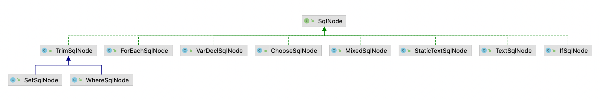

**SqlSourceBuilder**

1. 解析sql语句中的占位符(`#{__frc_item_0, javaType=int, jdbcType=NUMERIC, typeHandler=MyTypeHandler.class}`)定义的属性
2. 将sql语句中的占位符`#{}`替换成`?`

处理后的sql语句， 用户传入的实参类型， 形参和实参的对应关系

`ParameterMappingTokenHandler` 解析`#{}`占位符中的参数属性 以及替换占位符

`ParameterMapping` 记录#{}占位符中的参数属性(名称，java类型，TypeHandler，ResultMap等)

**BoundSql** 记录sql语句 和 参数

**DynamicSqlSource** 负责解析动态sql语句(组合模式)

​    SqlSourceBuilder解析参数属性，将sql中的`#{}`替换成`?`

**RawSqlSource**: 处理只包含#{}，不包含${}和动态节点的语句

`XmlScriptBuilder`中判断sql节点是否为动态的

如果某个节点只包含${}占位符，不包含动态sql节点或未解析的${}占位符，则不是动态语句 创建 `StaticSqlSource `对象

如果整个节点不是动态的sql节点，创建 `RawSqlSource `对象

#### 3.3 ResultSetHandler

`StatementHandler`接口在执行完指定的select语句之后，将查询到的结果交给`ResultSetHandler`完成映射处理 或 处理存储过程执行后的输出参数

`DefaultResultSetHandler`是唯一实现

`handleResultSets() `// 处理`Statement, PreparedStatement`产生的结果集，还可以处理`CallableStatement`调用存储过程产生的多结果集(`select resultSets="user,blog"`)

```xml
<select id="selectBlog" resultSets="blog,authors" resultMap="blogResult" statementType="CALLABLE">
    { call getBlogsAuthors(#{id, jdbcType=INTEGER, mode=IN}) }
</select>
<resultMap id="blogResult" type="Blog">
    <constructor>
        <idArg column="id" javaType="int"/>
    </constructor>
    <result property="title" column="title"/>
    <association property="author" javaType="Author" resuoltSet="authors" column="author_id" foreignCOlumn="id">
        <id property="id" column="id"/>
        <result property="username" column="username"/>
        <result property="password" column="password"/>
    </association>
</resultMap>
```

**ResultSetWrapper**

`DefaultResultSetHandler`会将从数据库中查询得到的`ResultSet`对象封装成`ResultSetWrapper`进行处理

`ResultSetWrapper`记录了`ResultSet`中的一些元数据，并提供一系列操作`ResultSet`的辅助方法

记录了(ReesultSet对象本身，所有列名，java类型，jdbc类型，TypeHandler对象(Map)，被映射的列名，未映射的列名)

单个ResultSet的映射

DefaultResultSetHandler.handleResultSet -> handleRowValues -> handleRowValuesForSimpleResultMap

1. 调用skipRows()方法，根据RowBounds中的offset 值定位到指定的记录行.
2. 调用shouldProcessMoreRows()方法，检测是否还有需要映射的记录.
3. 通过resolveDiscriminatedResultMap()方法，确定映射使用的ResultMap对象.
4. 调用getRowValue()方法对ResultSet中的一行记录进行映射:
    1. 通过createResultObject()方法创建映射后的结果对象.
    2. 通过shouldApplyAutomaticMappings()方法判断是否开启了自动映射功能.
    3. 通过applyAutomaticMappings()方法自动映射ResultMap中未明确映射的列.
    4. 通过applyPropertyMappings()方法映射ResultMap中明确映射列，到这里该行记录的数据已经完全映射到了结果对象的相应属性中.
5. 调用storeObject()方法保存映射得到的结果对象.

ResultHandler  
select语句 提供自定义结果处理逻辑,通常在数据集非常庞大的情形下使用  
`void handleResult(ResultContext<? extends T> resultContext);`  
ResultHandler 参数允许自定义每行结果的处理过程。可以将它添加到 List 中、创建 Map 和 Set，甚至丢弃每个返回值，只保留计算后的统计结果  
ResultContext 参数允许你访问结果对象和当前已被创建的对象数目(使用带 ResultHandler 参数的方法时，收到的数据不会被缓存)

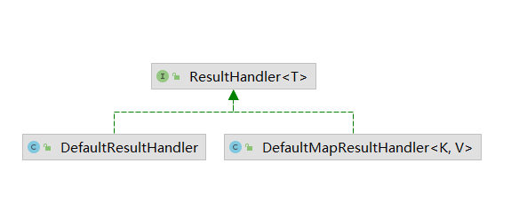  
DefaultResultHandler: 使用List暂存的结果  
DefaultMapResultHandler: 使用Map暂存结果

DefaultResultContext  
暂存映射后的结果对象，对象个数，是否停止映射三个字段

嵌套映射

嵌套查询 延迟加载  
延迟加载(fetchType, lazyLoadingEnabled)：暂时不用的对象不会真正载入到内存中，真正使用改对象时，才去执行数据库查询操作，将该对象加载到内存中  
MyBatis中，如果一个对象的某个属性需要延迟加载，在映射该属性时，会为该属性创建相应的代理对象并返回  
aggressiveLazyLoading(default=false): true表示有延迟加载属性的对象在被调用，将完全加载其属性，否则将按需要加载属性  
延迟加载通过动态代理实现，由于bean没有实现任何接口，无法使用JDK动态代理，MyBatis中采用的是CGLIB和JAVASSIST  
cglib采用字节码技术实现动态代理功能，通过字节码技术为目标类生成一个子类，在该类中采用方法拦截的方式拦截父类方法的调用，实现代理功能  
(无法代理final修饰的方法)    
Javassist动态修改类结构，或动态生成类

ResultLoader ResultLoaderMap  
ResultLoader 负责保存一次延迟加载操作所需的全部信息  
loadResult 通过excutor执行resultLoader中记录的sql语句返回相应的延迟加载对象

```text
Configuration对象，用于执行延迟加载操作的Executor对象，延迟执行的sql语句和相关配置信息，sql的实参，延迟加载得到的对象类型，
延迟加载得到的结果对象，将延迟加载得到的结果对象转换成目标类型，ObjectFactory工厂对象 通过反射创建延迟加载的Java对象，
CacheKey，创建ResultLoader的线程id  
```

ResultLoaderMap  
使用Map<String, LoadPair>保存对象中延迟加载属性和对应的ResultLoader对象  
key是转换成大写的属性名，value是LoadPair(内部类)  
load 加载指定名称的属性  
loadAll 加载对象中全部的延迟加载属性  
将加载得到的嵌套对象设置到外层对象中

org.apache.ibatis.executor.loader.ProxyFactory 创建代理对象  
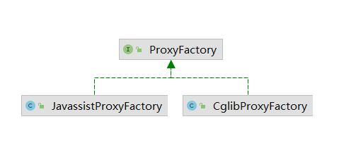

1. CglibProxyFactory 使用内部类 EnhancedResultObjectProxyImpl(MethodInterceptor).createProxy创建对象，创建过程中intercept会
   根据当前调用的方法名称，决定是否触发对延迟加载的属性进行加载；实现WriteReplaceInterface接口
2. JavassistProxyFactory 实现MethodHandler接口

DefaultResultSetHandler 中的延迟加载 和 嵌套查询  
createParameterizedResultObject 获取<resultMap>中配置的构造函数和参数值，选择合适的构造函数创建结果对象  
如果某个构造函数中是通过嵌套查询获取的，则需要通过getNestedQueryConstructorValue创建该参数值  
在创建构造函数的参数时涉及的嵌套查询，无论配置如何，都不会延迟加载；在其他属性的嵌套查询中，才会有延迟加载的处理逻辑

多结果集处理  
游标  
输出类型的参数(存储过程)

KeyGenerator  
获取插入记录时产生的自增主键  
oarcle, db2 等是通过sequence实现自增的，在执行insert之前必须明确指定主键的值  
mysql, postgresql 等在执行sql时，可以不指定主键，在插入过程中由数据库自动生成自增主键    
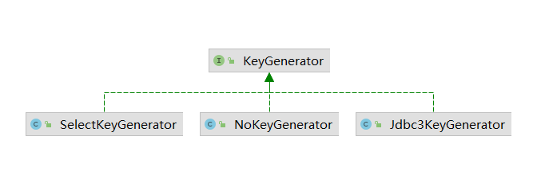

```text
useGeneratedKeys:
（仅适用于insert和update）这会令MyBatis使用JDBC的getGeneratedKeys方法来取出由数据库内部生成的主键
（比如：像MySQL和SQL Server这样的关系型数据库管理系统的自动递增字段），默认值：false。
processBefore // 在执行insert之前执行，设置属性order="BEFORE"
processAfter // 在执行insert之后执行，设置属性order="AFTER"
```

1. Jdbc3KeyGenerator  
   用于**取回**数据库生成的自增id，只实现了processAfter方法

2. SelectKeyGenerator MyBatis提供来**生成**主键，执行<selectKey>节点的sql语句，获取insert语句需要的主键并映射成对象，按照配置，将主键对象中对应的属性设置到用户参数中

3.5 StatementHandler  
功能：创建Statement，为sql语句绑定实参，执行select、insert等多种类型的sql语句，批量执行sql，将结果集映射成对象  
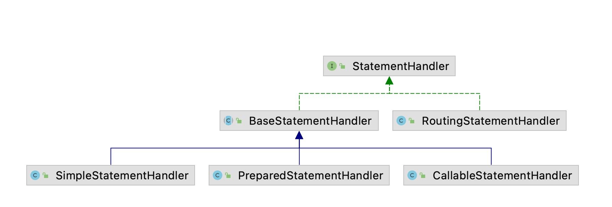

1. RoutingStatementHandler(**装饰器/策略**)：根据MappedStatement中指定的statementType字段，创建对应的StatementHandler接口实现
2. BaseStatementHandler：提供参数绑定相关的方法(将传入的实参替换sql语句中的'?')，没有实现操作数据库的方法

```text
   ParameterHandler  
   只有一个方法 setParameters，一个实现类DefaultParameterHandler
   遍历BoundSql.parameterMappings集合中记录的ParameterMapping对象，根据其中记录的参数名称查找相应实参，然后与sql语句绑定
```

3. SimpleStatementHandler：使用java.sql.Statement完成数据库相关操作，所有sql语句中不能存在占位符  
   通过JDBC Connection创建Statement对象，通过query完成数据库查询操作，通过ResultSetHandler将结果集映射成对象

4. PreparedStatementHandler：使用java.sql.PreparedStatement对象完成数据库的相关操作
5. CallableStatementHandler：使用java.sql.CallableStatement调用指定存储过程

3.6 org.apache.ibatis.executor.Executor 接口(模板+装饰器)  
定义操作数据库的基本方法  
执行update, insert, delete类型的语句，批量执行sql，提交/回滚事务，查找缓存，关闭Executor对象等  
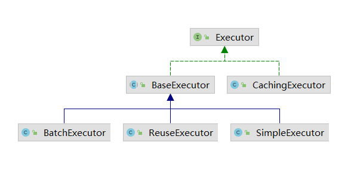  
模板策略：一个算法分为多个步骤，这些步骤的执行次序在一个被成为'模板方法'的方法中定义，算法的每个步骤对应着一个方法，被成为基本方法。
模板方法按照定义的顺序依次调用多个基本方法，完成整个流程。在模板方法的模板中，将模板方法的实现以及那些固定不变的基本方法的实现放在父类中， 不固定的基本方法在父类中只是抽象方法，真正的实现被延迟到子类中。

1. BaseExecutor  
   实现了大部分方法(四个未实现doUpdate, doQuery, doQueryCursor, doFlushStatement)，主要提供**缓存管理**和**事务管理**的基本功能  
   **一级缓存**：会话级别的，默认开启，每创建一个SqlSession表示开启一次会话，生命周期与SqlSession相同(也就是SqlSession中封装的Executor生命周期相同)  
   query方法：首先创建CacheKey对象，根据CacheKey对象查找以及缓存，如果命中缓存就返回缓存中记录的结果对象，如果没有命中就查询数据库获取结果集， 之后将结果集映射成结果对象保存到一级缓存中，同时返回结果对象。  
   CacheKey(缓存中的key，可以添加多个对象(存入updateList)，共同决定两个key是否相同)  
   加入的对象：MappedStatement的id，offset和limit，包含?的sql语句，用户传递的实参，Environment的id 五部分组成
    1. 缓存查询到的结果对象
    2. 嵌套查询时，如果一级缓存中缓存了嵌套查询的结果对象，则直接获取；如果一级缓存中记录嵌套查询的结果对象没有完全加载，通过DeferredLoad实现延迟加载
   ```text
    isCached 检测是否缓存的指定查询的结果对象
    deferLoad 负责创建DeferredLoad对象将其添加到deferredLoads集合中
   ```
   DeferredLoad(内部类)负责从localCache缓存中延迟加载结果对象

    ```text
    DeferredLoad.canLoad方法负责检测缓存项是否完全到了缓存中
        1. 检测缓存是否存在指定的结果对象
        2. 检测是否为占位符
    BaseExecutor.queryFromDatabase方法
        1. 开始调用doQuery方法查询数据库之前，会先在localCache中添加占位符，
        2. 完成数据库查询操作，返回结果对象
        3. 删除占位符
        3. 查询完成之后，将真正的结果放到一级缓存localCache中，返回数据
    ```

   最外层查询结束，所有的嵌套查询结束，相关缓存项也已经完全加载后触发DeferredLoad加载一级缓存中记录的嵌套查询的结果对象， 加载完成后清空(flushCache,
   localCacheScope两个配置决定是否清空一级缓存)  
   deferredLoads集合 update方法：执行insert, update, delete三类sql，调用doUpdate模板方法实现，调用之前清空缓存(因为执行sql之后一级缓存中的数据和数据库中的数据已经不一致了(
   肮数据))  
   **事务相关**：BatchExecutor可以缓存多条sql，然后等待合适的时机将多条sql一起发送到数据库执行(flushStatements方法会在commit/rollback方法之前被调用)  
   commit/rollback方法：先清空一级缓存，再flushStatements方法，最后根据参数决定是否真正提交事务

2. SimpleExecutor  
   继承BaseExecutor，不提供批量处理sql语句功能，采用模板方法，只需要专注四个基本方法的实现  
   query:
    1. 获取Configuration配置对象
    2. 创建StatementHandler对象，实际返回RoutingStatementHandler对象(根据MappedStatement.statementType选择具体的StatementHandler实现)
    3. 完成Statement的创建和初始化，并处理占位符
    4. 调用StatementHandler.query方法，执行sql，并通过ResultSetHandler完成结果集映射
    5. 关闭Statement对象

3. ReuseExecutor  
   提供重用Statement功能，通过Map<sql语句, Statement>缓存使用过的Statement对象  
   与SimpleExecutor不同的是prepareStatement方法；  
   SimpleExecutor每次都会通过JDBC Connection重新创建Statement对象  
   ReuseExecutor会尝试重用缓存的Statement对象
    1. 获取sql语句
    2. 检测是否已经缓存了相同模式的sql对应的Statement对象
        1. 如果已经缓存了，就从Map中拿出来，并修改超时时间
        2. 如果没有缓存，就获取数据库连接，创建新的Statement对象，放入Map中
    3. 处理占位符

   事务提交回滚连接关闭时，需要关闭缓存的Statement对象，在doFlushStatements中完成Statement对象的关闭  
   每个Statement对象只能对应一个结果集，多次调用queryCursor方法执行同一条sql时，会复用同一个Statement对象，只有最后一个ResultSet可用  
   // queryCursor方法返回的时Cursor对象，用户在迭代Cursor对象时，才会真正遍历结果集对象并进行映射操作，可能导致前面创建的Cursor对象中封装的结果集关闭  
   // 完成结果集处理后，fetchNextObjectFromDatabase方法会调用DefaultCursor.close方法将其中封装的结果集关闭，同时关闭结果集对应的Statement对象  
   // 会导致缓存的Statement对象关闭，后面继续使用会出现空指针异常  
   ReuseExecutor.query方法，在select语句执行之后，会立刻将结果集映射成结果对象，然后关闭结果集，但是不会关闭Statement对象

4. BatchExecutor  
   批量处理多条sql语句，只支持insert, update, delete类型，不支持select

```text
List<Statement> 缓存多个Statement对象，每个Statement对象有多条sql  
List<BatchResult> 记录每个Statement对象执行批处理的结果  
String sql 记录当前执行的sql
MappedStatement 记录当前执行的MappedStatement对象(表示映射文件中定义的sql节点)
```

doUpdate  
如果当前执行的sql模式与上次执行的sql模式相同并且对应的MappedStatement相同，获取集合中的最后一个Statement，绑定实参，处理占位符，查找对应的BatchResult对象，记录用户传入的实参  
如果不相同，去创建新的Statement对象，绑定实参，处理占位符，更新当前sql和当前MappedStatement，将创建的Statement对象放入集合，添加新的BatchResult对象  
将连续添加的，相同模式的sql语句放到同一个Statement/PreparedStatement对象中，减少编译的次数  
doFlushStatements  
批量处理sql，遍历所有的Statement对象一次执行，并处理返回值(影响的行数)，保存结果集对象，关闭所有的Statement  
doQuery doQueryCursor  
与SimpleExecutor类似，就是会在调用前flushStatements，执行缓存的sql来确保从数据库中拿到最新的数据

5. CachingExecutor  
   一个Executor的装饰器，提供二级缓存功能    
   二级缓存的生命周期与应用程序的生命周期相同

```text
配置
mybatis-config.xml  ->  cacheEnabled=true 总开关
<cache> <cache-ref>  添加以后默认会创建Cache对象(默认是PerpetualCache)
<select useCache=true>  表示查询的结果是否保存到二级缓存中  
```

CachingExecutor中依赖的两个组件

1. TransactionalCache  
   继承Cache接口，用来保存在某个SqlSession的某个事务中需要向某个二级缓存中添加的缓存数据  
   将需要放入二级缓存的数据暂时存放在集合中，等事务提交时才会真正放进去
2. TransactionalCacheManager  
   用来管理CachingExecutor使用的二级缓存对象，定义了一个HashMap<Cache, TransactionalCache>  
   key时对应的CacheExecutor使用的二级缓存对象，value是相应的TransactionalCache对象(封装对应的二级缓存对象，就是key)  
   clear, putObject, getObject 调用二级缓存对应的TransactionalCache对象的对应方法  
   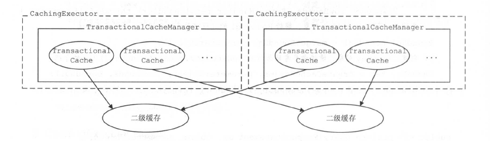

query  
执行查询操作

1. 获取BoundSql，创建查询语句对应的CacheKey对象
2. 检测是否开启二级缓存，没有开启就直接调用底层Executor对象查询数据库；开启了继续下面的步骤
3. 检测查询操作是否有输出类型(存储过程)的参数，有的话报错
4. 调用TransactionalCacheManager.getObject 查询二级缓存，如果找到了直接返回，
5. 如果没找到，调用底层Executor对象的query方法，先查询一级缓存，如果未命中去查询数据库；
6. 将得到的结果放入缓存集合中保存

commit/rollback  
都会先调用底层executor的方法来提交/回滚事务，然后遍历所有相关的TransactionalCache对象来提交/回滚事务

不同的CacheExecutor由不同的线程操作  
CacheBuilder.build方法会调用CacheBuilder.setStandardDecorators为PerpetualCache类型的Cache对象添加装饰器，这个过程中会添加SynchronizedCache这个装饰器，来保证二级缓存的线程安全  
事务提交时才会将entriesToAddOnCommit集合中缓存的数据写入二级缓存，用来避免`脏读`  
TransactionalCache.entriesMissedInCache集合的作用  
与BlockingCache相关，查询二级缓存会调用getObject方法，如果二级缓存中没有对应数据，就去查询数据库最后将结果putObject放入二级缓存  
如果用了BlockingCache，getObject会有加锁过程，putObject会有解锁过程，如果两者之间出现异常，可能会无法释放锁，导致缓存项无法被其他SqlSession使用  
因此使用该集合记录未命名的CacheKey，也就是加了锁的缓存项，`entriesToAddOnCommit`是`entriesMissedInCache`集合的子集，也就是正常解锁的缓存项  
对于未正常结束的缓存项，会在事务提交或回滚时进行解锁操作

6. 接口层  
   SqlSession 接口层的主要组成部分，对外提供MyBatis常用API  
   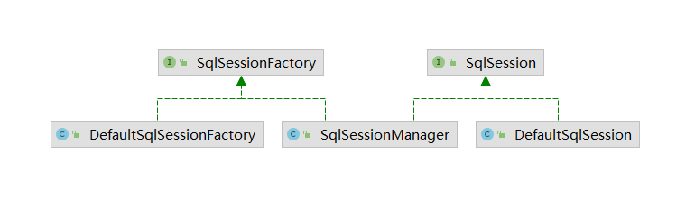

   SqlSessionFactory负责创建SqlSession对象，其中包含多个openSession方法的重载，可以通过参数指定事务的隔离级别、使用的Executor类型、是否自动提交事务等配置  
   SqlSession中定义常用的数据库操作和事务相关操作，对每种类型(select, update, delete, insert)的操作都提供多种重载

   策略：定义封装一系列算法，互相之间可以互相替换(开放封闭原则)    
   DefaultSqlSession 是调用者，将数据库相关相关的操作封装到Executor接口中实现，通过executor字段选择不同的Executor实现  
   select*方法最终调用query(MappedStatement, Object, RowBounds, ResultHandler)方法完成数据库查询操作  
   各自对结果进行调整：
    1. selectOne 从结果对象集合中获取第一个元素返回
    2. selectMap 方法将List类型的结果对象集合转换成Map类型集合返回
    3. select 方法将结果对象集合交由用户指定的ResultHandler对象处理，且没有返回值
    4. selectList 方法直接返回结果对象集合

   insert*, update*, delete*方法最终是通过DefaultSqlSession.update(String, Object) 方法实现  
   首先将dirty字段设为true(有脏数据)，然后调用Executor.update方法完成数据库修改操作  
   commit, rollback, close 方法调用Executor中相应的方法完成(涉及清空缓存操作，最后将dirty字段设为false)

   DefaultSqlSessionFactory (implenents SqlSessionFactory)  
   提供两者创建DefaultSqlSession的方法
    1. 通过数据源获取数据库连接，并创建Executor对象以及DefaultSqlSession对象，使用完立刻关闭(获取mybatis-config.xml中配置的Environment对象)
    2. 用户提供数据库连接对象，然后使用该对象创建Executor对象以及DefaultSqlSession对象

   SqlSessionManager (implements SqlSession, SqlSessionFactory)  
   同时提供 SqlSessionFactory创建SqlSession对象 和 SqlSession操纵数据库功能
   ```text
        private final SqlSessionFactory sqlSessionFactory; // 工厂对象
        private ThreadLocal<SqlSession> localSqlSession = new ThreadLocal<SqlSession>(); // 记录一个与当前线程绑定的SqlSession对象
        private final SqlSession sqlSessionProxy; // 上面记录的SqlSession的代理对象，在SqlSessionManager中使用JDK动态代理创建代理对象
   ```
   提供两种模式：
    1. 与DefaultSqlSessionFactory相同，统一线程每次通过SqlSessionManager对象访问数据库时，都会创建新的DefaultSession对象完成数据库操作
    2. SqlSessionManager通过localSqlSession这个ThreadLocal这个变量，记录与当前线程绑定的SqlSession对象，当前线程循环使用，避免同一线程多次创建SqlSession对象

   SqlSessionManager.openSession方法使用底层封装的SqlSessionFactory对象的openSession方法来创建SqlSession对象  
   SqlSessionManager.select*/update等方法直接调用sqlSessionProxy字段记录的SqlSession代理对象的相应方法实现的

### 4. 插件

1. 插件

采用 责任链 和 JDK动态代理 的模式，通过拦截器Interceptor实现  
可拦截方法：

```text
这四个都是接口，所以可以用JDK动态代理为其实现类创建代理对象
Executor: update, query, flushStatements, commit, rollback, getTransaction, close, isClosed
ParameterHandler: getParameterObject, setParameters
ResultSetHandler: handleResultSets, handleOutputParameters
StatementHandler: prepare, parameterize, batch, update, query
这四种对象都是通过Configuration.new*方法创建的
如果配置了拦截器，会通过InterceptorChain.pluginAll方法为目标对象用JDK动态代理创建代理对象
```

org.apache.ibatis.plugin.Interceptor

```text
interceptor: 具体的拦截逻辑
plugin: 是否触发上面的拦截逻辑
setProperties: 根据配置初始化Interceptor对象
```

@Intercepts: 指定一个@Signature注解列表，每个注解中都标识了该插件需要拦截的方法信息  
@Signature: 用来确定唯一的方法签名(type 需要拦截的类型; method 需要拦截的对象; args 被拦截方法的参数列表)

MyBatis初始化时，会解析xml配置文件 或 注解 ，将拦截器对象进行初始化并保存到Configuration.interceptorChain字段中

```text
Plugin.wrap 静态方法可以用来创建代理对象  
Plugin(implement InvocationHandler)中封装了 目标对象，Interceptor对象，记录@Signature注解中的信息
invoke方法会获取当前方法所在类或接口中，可被Interceptor拦截的方法
如果当前调用的方法需要被拦截，就调用Interceptor.intercept方法进行拦截
如果当前调用的方法不能被拦截，直接调用目标对象相应的方法

Interceptor.intercept(Invocation)
Invocation对象封装了 目标对象，目标方法，调用目标方法的参数，proceed方法调用目标方法
```

应用场景  
分页插件 MyBatis自带的RowBounds分页方法，通过循环调用ResultSet.next方法定位到指定的行  
插件：拦截Executor.query方法，同RowBounds参数获取所需记录的起始位置，根据不同的数据库(策略)给BoundSql参数添加limit等片段

MyBatis 和 Spring 集成  
mybatis-spring-2.0.6.jar  
MyBatis初始化时，SqlSessionFactoryBuilder通过XMLConfigBuilder等对象读取mybatis-config.xml配置文件和映射配置信息，得到Configuration对象  
与Spring集成之后，SqlSessionFactory对象通过SqlSessionFactoryBean对象(如果用xml配置，需要指定数据源，配置mybatis-config.xml文件位置)创建

如果配置文件中没有明确为SqlSessionFactoryBean指定transactionFactory属性，就使用默认的SpringManagedTransactionFactory  
该类的newTransaction方法返回SpringManagedTransaction

SqlSessionTemplate 核心  
实现了SqlSession接口，用来代理DefaultSqlSession功能  
可以用来完成指定的数据库操作，线程安全，可以在dao层共享  
通过调用sqlSessionProxy(用Jdk动态代理生成的代理对象)的相应方法实现SqlSession接口的所有方法  
SqlSessionInterceptor 接口 会检测事务是否由Spring管理决定是否提交事务  
SqlSessionUtils.getSession方法，会尝试从Spring事务管理器中获取SqlSession对象  
获取成功就直接返回，否则通过SqlSessionFactory创建SqlSession对象然后交给Spring的事务管理器

SqlSessionDaoSupport  
DaoSupport 用来辅助开发人员编写dao层代码  
通过继承该类方便获取SqlSessionTemplate对象，完成数据库访问操作

MapperFactoryBean MapperScannerConfigurer  
MapperFactoryBean 是一个动态代理类，直接将Mapper接口注入到Service层的Bean中

new SQL{{}} 动态生成sql语句  
用户可自定义sql语言驱动器(实现 org.apache.ibatis.scripting.LanguageDriver接口，注册进去)
@Lang(MyLanguageDriver.class) | <select id="" lang="myLanguage"> 对特殊语句指定特定的语言驱动器  


