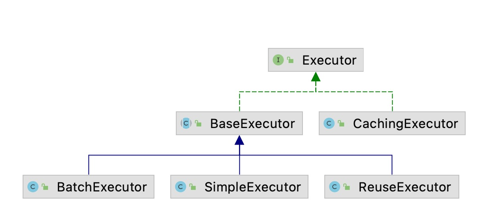
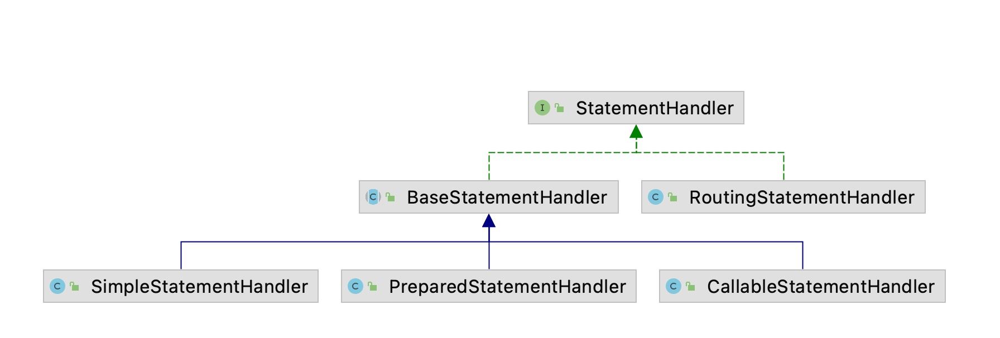
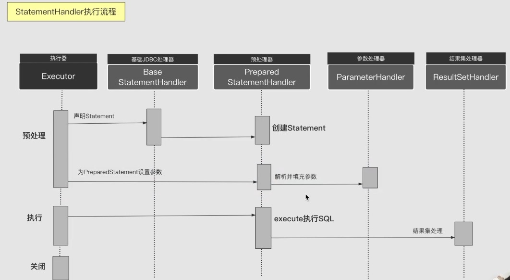

### mybatis执行器

**SqlSession**(门面):

1. 基本api 增删查改
2. 辅助api 提交关闭会话

**Executor**：

sqlSession 和 Executor 是一对一的关系

1. 基本功能： 改 查 维护缓存 事务管理
2. 辅助api: 提交关闭执行器，批处理刷新  
   

BaseExecutor (公共操作 一级缓存 获取连接 query update)  
CachingExecutor (二级缓存 装饰器delegate)  
SimpleExecutor 简单执行器 (实现doQuery, doUpdate)  
ReuseExecutor 可重用执行器  
BatchExecutor 批处理执行器 只针对修改操作，需要手动刷新

装饰器模式(在不改变原有类结构和继承的情况下，通过包装原对象去扩展一个新功能)

**一级缓存命中场景**  
作用域为session  
一级缓存：BaseExecutor  
二级缓存：CachingExecutor

命中场景:  
运行时参数相关:

1. sql 和 参数相同
2. 相同的StatementId (com.mybatis.learn.mapper.BlogMapper.getBlogById)
3. sqlSession必须相同
4. RowBounds 返回行范围必须相同

操作和配置相关

1. 没有手动清空 提交 回滚 sqlSession.clearCache();
2. 未调用flushCache=true的查询
3. 未执行Update(数据一致性问题)
4. 缓存作用于不是Statement(Configuration里面的localCacheScope (Session, Statement(作用于嵌套查询，子查询)))

Mapper ->  SqlSession ->  BaseExecutor ->  StatementHandler

| 动态代理接口 | 会话模板 | 会话拦截器 | 会话工厂 |  
| --- | --- | ---- | --- |
|Mapper | SqlSessionTemplate | SqlSessionInterceptor | SqlSessionFactory |

**二级缓存**
应用级缓存

1. 存储位置
2. 溢出淘汰
3. 过期清理
4. 线程安全
5. 命中率统计
6. 序列化

**StatementHandler**:

1. 生命JdbcStatement 填充参数
2. sql执行  
   jdbc处理器
   
   执行语句，预编译，设置参数，执行jdbc，结果集映射

| 执行器 | 基础jdbc处理器 | 预处理器 | 参数处理器 | 结果处理器 | 
| --- | --- | --- | --- | --- |
| Executor | BaseStatementHandler |PreparedStatementHandler | ParameterHandler | ResultSetHandler |



参数处理  
java bean -> jdbc参数

ParamNameResolver

1. 单个参数 默认不转换，除非设置了@Param
2. 多个参数
    1. 转换成Param1, Param2 -> Map
    2. 通过@Param中的name属性转换
    3. 基于反射转换成变量名，如果不支持(jdk7)转换成arg0, arg1

ParameterHandler

1. 单个原始类型 直接映射，忽略sql中的引用名称
2. Map类型 基于key映射
3. Object 基于属性名映射，支持嵌套对象属性访问(MetaObject)

ResultSetHandler(将结果集的行转换成对象)  
ResultContext(存放当前行对象，以及解析状态和控制解析数量)  
ResultHandler(处理存入解析结果)

mybatis映射体系(反射)  
**MetaObject**

1. 查找属性， 忽略大小写，支持驼峰，支持子属性
2. 获取属性值
    1. 基于点获取子属性 user.name
    2. 基于索引获取列表值 users[1].name
    3. 基于key获取map值 user[name]
3. 设置属性
    1. 可设置子属性值
    2. 支持自动创建子属性(必须带有无参构造函数，不能有集合)

**BeanWrapper**(只能设置当前对象的属性，不能设置属性的属性)

1. 查找属性
2. 获取属性值
3. 设置属性
4. 创建属性

**MetaClass**  
基于属性名获取set, get方法，支持子属性获取

**Reflector**  
基于属性名获取set, get方法，属性类别，不支持子属性获取

**手动结果集映射**
ResultMap  
ResultMapping

1. constructor
2. id
3. result
4. association(一对一)
5. collection(一对多)
    1. 复合映射
       ```html
       <resultMap id="blogMap" type="blog">
         <id></id>
         <result></result>
         <association property="comments">
           <id column="id" property="id"></id>
           <result column="body" property="body"></result>
         </association>
       </resultMap>
       ```
    2. 嵌套查询
       ```html
       <resultMap id="blogMap" type="blog">
         <id></id>
         <result></result>
         <association property="comments" select="selectCommentByBlogId">
         </association>
       </resultMap>
       <select id="selectCommentByBlogId" />
       ```
    3. 外部映射
       ```html
       <resultMap id="blogMap" type="blog">
         <id></id>
         <result></result>
         <association property="comments" resultMap="commentMap">
         </association>
       </resultMap>
       <resultMap id="commentMap" type="comment">
         <id column="id" property="id"></id>
         <result column="body" property="body"></result>
       </resultMap>
       ```

**自动映射**  
列名 <----> 属性名

1. 列名和属性名同事存在(忽略大小写)
2. 当前列未手动设置映射
3. 属性类别存在TypeHandler
4. 开启autoMapping(默认开启)

UmMappedColumnAutoMapping

**嵌套子查询**

```html

<resultMap id="blogMap" type="blog">
    <result column="title" property="title"></result>
    <association property="author" column="authorId" select="selectUserByBlogId"></association>
    <collection property="comments" select="selectCommentsByBlogId"></collection>
</resultMap>
<select id="selectUserByBlogId" resultType="user">
    select * from users where id=#{userId}
</select>
<select id="selectCommentsByBlogId" resultType="comment">
    select * from comment where blogId=#{blogId}

</select>
```

**循环依赖流程**  
填充属性 (填充属性是触发子查询 queryStack 手动填充是会触发懒加载 DefaultResultSetHandler)  
获取嵌套查询值 getNestedQueryMappingValue  
执行准备

1. 准备参数
2. 获取MappedStatement
3. 获取动态sql
4. 创建缓存key

是否命中一级缓存 ->  延迟装载 deferLoad  
是否懒加载 ->  懒加载  
实时加载

**懒加载**  
代理

| 装载器 | 执行器 | 数据库 |
| --- | --- | --- |
| ResultLoader | Executor | 数据库 |


