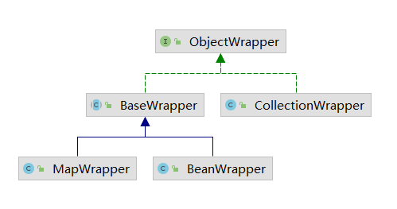
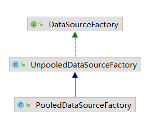
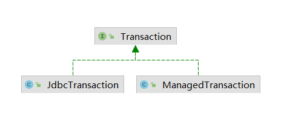
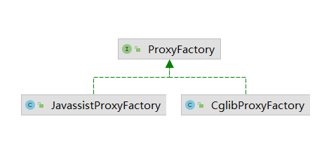
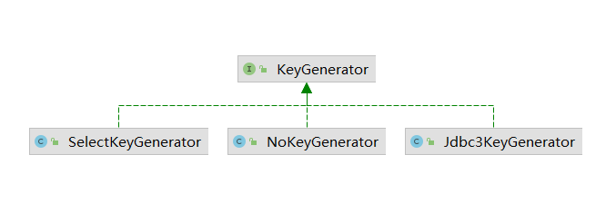

### mybatis技术内幕

1. **接口层** sqlSession
2. **核心处理层** 配置解析，参数映射，sql解析，sql执行，结果集映射，插件
3. **基础支持层** 数据源模块，事务管理模块，缓存模块，Binding模块，反射模块，类型转换，日志模块，资源加载，解析器模块


#### 基础支持层

2.1 解析器模块  
相关类(org.mybatis.ibatis.parsing)：XPathParser XNode TokenHandler PropertyParser  
GenericTokenParser 字占位符解析器：按顺序查找openToken和closeToken，解析得到占位符的字面量，交给TokenHandler处理，将解析结果 重新拼装成字符串并返回  
不仅可以用于默认值解析，也可以用于动态sql语句的解析

TokenHandler有四个实现

1. VariableTokenHandler(PropertyParser的私有静态内部类)
2. ParameterMappingTokenHandler
3. DynamicCheckerTokenParser
4. BindingTokenParser

2.2 反射工具

1. **Reflector**(缓存反射操作需要使用的类的元信息)  
   JavaBean:
   字段: 定义的成员变量 属性: 通过getter/setter得到的(只与类中的方法有关，与是否存在成员变量没有关系)  
   定义的字段：
    1. 可读/写属性的名称集合 String[]
    2. 属性相应的setter/getter方法 Map<String, Invoker> (key: 属性名称, value: 对应setter/getter方法对应Method对象的封装)
    3. 属性相应setter/getter方法的返回值类型 Map<String, Class<?>> (key: 属性名, value: setter/getter方法的返回值类型)
    4. 默认的构造方法 Constructor<?>
    5. 所有属性名称的集合

   Map<String, Invoker> getMethods = new HashMap<>();  
     
   invoke(Object target, Object[] args)  用于获取指定字段的值(getXxx)或执行指定的方法(Method.invoke())  
   getType() 返回属性相应的类型

    1. 查找默认的构造方法(无参的)
    2. addGetMethods(clazz) 处理clazz中的getter方法，填充getMethods和getTypes集合
        1. getClassMethods(clazz) 获取当前类及其父类中定义的所有方法的唯一签名 和 对应的Method对象
        2. 从上面方法中返回的数组中查找该类中定义的所有getter方法(暂时存放到conflictingGetters集合中)
        3. resolveGetterConflicts 子类覆盖父类的getter方法且返回值发生变化时，处理冲突
    5. addFields(clazz) 处理类中定义的所有字段，将处理后的字段信息添加到集合中(final static can only be set by the classloader)  
       同时提供了多个get*()方法用于读取上述集合中记录的元信息

   ReflectorFactory接口 实现对Reflector对象的创建和缓存  
   DefaultReflectorFactory  
   使用ConcurrentHashMap<Class, Reflector>完成对Reflector对象的缓存

2. **TypeParameterResolver**  
     
   java.lang.reflect.Type接口:
    1. 子接口: ParameterizedType, GenericArrayType, TypeVariable, WildcardType
        1. ParameterizedType 参数化类型 List<String>  
           Type getRawType 返回参数化类型中的原始类型List  
           Type[] getActualTypeArguments 返回类型变量或实际类型列表 String  
           Type getOwnerType 返回类型所所属类型 Map<K,V>接口是Map.Entry<K, V>接口的所有者
        2. TypeVariable 类型变量，反应在JVM编译该泛型前的信息 List<T> T就是类型变量  
           Type[] getBounds 获取类型变量的上界，为明确声明则为Object Test<T extends User> -> User  
           D getGenericDeclaration 获取声明改类型变量的原始类型 Test<T extends User> -> Test  
           String getName 获取源码中定义的名称 T
        3. GenericArrayType 表示数组类型且组成元素是ParameterizedType 或 TypeVariable  
           Type getGenericComponentType 返回数组的组成元素
        4. WildcardType 通配符泛型(<? extends Number>, <? super Integer>)  
           Type[] getUpperBounds 返回泛型变量上界  
           Type[] getLowerBounds 返回泛型变量下界
    2. 实现类: Class
        1. Class: 它表示的是原始类型。Class 类的对象表示JVM中的一个类或接口，每个Java 类在JVM里都表现为一个Class 对象。在程序中可以通过“类名.class ”、“对象.getClass()
           ”或是Class.forName(类名)等方式获取Class。**数组也被映射为Class对象，所有元素类型相同且维数相同的数组都共享同一个Class对象**

   TypeParameterResolver 提供静态方法解析指定类中的字段，方法返回值或方法参数类型  
   存在复杂继承关系以及泛型定义时，该类帮助解析字段、方法参数、或方法返回值的类型  
   resolveFieldType() 解析字段类型

3. **ObjectFactory**  
   通过多个重载的create方法创建对象
    1. 设置配置信息
    2. 通过无参构造函数创建指定对象
    3. 根据参数列表选择指定的构造函数创建对象
    4. 检测指定类型是否为集合(用来处理java.util.Collection及其子类)
       DefaultObjectFactory是唯一实现  
       instantiateClass根据传入的参数列表选择合适的构造函数实例化对象

4. **Property**工具类
    1. PropertyTokenizer Iterable 对传入的表达式进行解析 (orders[0].items[0].name)
       当前表达式，当前表达式的索引名，索引下标，子表达式
    2. PropertyNamer 完成方法名到属性名的转换(将方法名开头的is, get, set去掉并将首字母小写)
    3. PropertyCopier 完成相同类型的两个对象之间的属性值拷贝

5. **MetaClass**  
   MetaClass 构造函数是私有的，通过静态方法(forClass)创建 通过组合Reflector和PropertyTokenizer完成对复杂属性表达式的解析，并获取指定属性描述信息  
   findProperty hasGetter hasSetter  
   封装一个Reflector对象(通过ReflectorFactory创建), 类级别的元信息封装和处理

6. **ObjectWrapper**
   对象级别的元信息处理：抽象了对象的属性信息，定义一系列查询和更新对象属性信息的方法  
   get(PropertyTokenizer) // 如果封装的是普通对象，调用相应属性对应的getter方法；如果是集合，获取指定key或下标对应的value (set(PropertyTokenizer, Object value)
   设置值)  
   findProperty(String, boolean) 查找属性表达式指定的属性 (是否忽略下划线)  
   getGetter/SetterNames 查找可写/读属性的名称集合  
   getGetter/SetterType 解析属性表达式指定属性的getter的参数类型/setter方法的返回值类型  
   hasGetter/Setter 判断指定属性是否有getter/setter方法  
   instantiatePropertyValue 为属性表达式的指定属性创建相应的MetaObject对象  
   isCollection add addAll (封装对象是否是Collection集合，向集合中添加对象)

   ObjectWrapperFactory(实现类DefaultObjectWrapperFactory不可用)负责创建ObjectWrapper  
     
   BaseWrapper(处理集合)
    1. resolveCollection 解析属性表达式并获取指定的属性
    2. get/setCollectionValue 解析属性表达式的索引信息，然后获取/设置对应项

   BeanWrapper(处理bean对象)  
   MapWrapper(处理Map<String, Object>类型的对象)  
   CollectionWrapper(不可用)

7. **MetaObject**
   完成属性表达式的解析过程

2.3 **TypeHandler**类型转换  
完成Java类型 和 JDBC类型的互相转换  
用于完成单个参数以及单个列值的类型转换，如果存在多列值转换成一个java对象，应有限考虑<resultMap>  
enum JdbcType代表JDBC中的数据类型，HashMap<TYPE_CODE, JdbcType>维护常量编码和JdbcType的关系

所有的类型转换器全部继承TypeHandler

1. setParameter 通过PreparedStatement为sql语句绑定参数时，将数据从JdbcType类型转换成Java类型
2. getResult 从ResultSet中获取结果时，将数据从Java类型转换成JdbcType类型

BaseTypeHandler 实现了TypeHandler接口，对于数据非空处理都交给了子类

TypeHandlerRegistry 管理众多的TypeHandler，MyBaits初始化时，会为所有已知的TypeHandler创建对象，注册在其中

1. 记录JdbcType与TypeHandler的对应关系(用于从结果集读取数据时，将数据从Jdbc类型转换成Java类型 char, varchar -> java.lang.String)
2. 记录Java类型向指定JdbcType转换时，需要使用的TypeHandler对象(一对多 java.lang.String -> char, varchar)
3. 记录全部TypeHandler的类型 和 相应的对象
4. 一个空TypeHandler集合标识

注册TypeHandler  
通过读取(@MappedJdbcTypes(JdbcType.VARCHAR), @MappedTypes({Date.class}))两个注解的内容，注册进去 或 扫描包下的类注册进去  
查找TypeHandler  
根据指定的JavaType 和 JdbcType查找相应的TypeHandler对象

TypeAliasRegistry 完成别名注册和管理功能(管理别名和java类型之间的关系)  
registerAlias(String, Class) key转小写放入  
registerAliases(packageName, Class) 扫描指定包下的所有类，为指定类的子类添加别名  
registerAlias(Class) 尝试读取@Alias注解

2.4 日志模块  
设计模式六大原则：

1. 单一职责原则
2. 里氏替换原则
3. 依赖倒置原则
4. 接口隔离原则
5. 迪米塔法则
6. **开放封闭原则**  程序要对扩展开放，对修改关闭

适配器模式  
需要适配的类(真正的业务逻辑) <--> 适配器 <--> 目标接口(调用者使用)  
com.apache.ibatis.logging.Log 定义日志模块的功能  
LogFactory 创建对应的日志组件适配器

代理模式 与 JDK动态代理    
代理模式可以控制对真正对象的访问，或在执行业务处理的前后进行相关的预处理和后置处理，还可以用于实现延迟加载(当系统真正使用数据时，再调用 代理对象完成数据库的查询并返回数据)功能  
静态代理：编译阶段就要创建代理类  
JDK动态代理：InvocationHandler接口，动态创建代理类并通过类加载器加载，然后在创建代理对象时将InvokeHandler对象作为构造参数传入，当调用代理对象时 ，会调用InvokerHandler.invoke()
方法，并最终调用真正的业务对象的相应方法。

```text
Proxy.newProxyInstance(ClassLoader loader, Class<?> interfaces, InvocationHandler h)
loader 加载动态生成的代理类的类加载器
interfaces 业务类实现的接口
h 实现InvocationHandler的对象

业务逻辑(java.lang.reflect.Proxy类中):
 1. 获取代理类的Class getProxyClass0(loader, interfaces)
   1. 限制接口数量 < 65536
   2. 如果指定的类加载器中已经创建了实现指定接口的代理类，就从缓存(WeakCache<ClassLoader, Class<?>[], Class<?>> proxyClassCache)中查找；否则通过ProxyClassFactory创建实现指定接口的代理类
   3. WeakCache.get先从缓存中查找代理类，如果找不到创建Factory(WeakCache的内部类)对象调用get方法获取代理类，Factory.get会调用ProxyClassFactory.apply(Proxy类中，是一个BiFunction<T, U, R>(提供两个参数，返回一个结果))创建并加载代理类
   4. apply方法先检测代理类需要实现的接口集合，确定代理类的名称，创建代理类并写入文件，最后加载代理类返回对应的Class对象用于后续实例化代理类对象
 2. 获取代理类的构造方法
 3. 创建代理对象
```

JDBC调试  
com.apache.ibatis.logging.jdbc包通过动态代理的方式将JDBC操作通过指定的日志框架打印出来  

BaseJdbcLogger ConnectionLogger 封装Connection对象同时为其封装的Connection对象创建相应的代理对象  
PreparedStatementLogger 封PreparedStatement对象，并为其创建相应的代理对象  
StatementLogger  
ResultLogger 封装ResultSet对象并为其创建代理对象 (展示查询结果)

2.5 资源加载  
org.apache.ibatis.io包封装ClassLoader以及读取资源文件的API  
ClassLoaderWrapper是ClassLoader包装器，确保返回给系统的时正确的加载器(安装指定的顺序依次检测封装的ClassLoader对象，从中选择一个可以的完成相关功能)  
包含 系统指定的默认加载 和 系统类(应用程序类)加载器  
类加载器顺序 [参数指定的类加载器，系统值的默认加载器，当前线程绑定的类加载器，加载当前类使用的类加载器，系统类加载器]  
Resources 调用封装的ClassLoaderWrapper返回数据  
ResolverUtil 根据指定条件查找指定包下的类  
条件Test(只有一个matches<Class>方法, IsA(检测类是否继承类指定类或接口) AnnotatedWith(检测类是否添加了指定注解))，类中封装了当前使用的类加载器(默认时当前线程上下文绑定的ClassLoader(
Thread.currentThread().getContextClassLoader()))  
单例模式(volatile禁止指令重排序；第一次访问类中的静态字段时，会触发类的加载)  
VFS 虚拟文件系统 查找指定路径下的资源，包括jar包

2.6 DataSource  
实现javax.sql.DataSource接口  
PooledDataSource 和 UnpooledDataSource 使用工厂创建  
工厂方法模式：添加新产品时，只需要添加对应的工厂实现类，而不必修改已有的代码。符合开放封闭原则。同时工厂方法先调用者隐藏具体产品的实例化细节 调用者只需要了解工厂接口和产品接口，面向接口编程。  
但是新增新产品实现类时，还要提供一个与之对应的工厂实现类，新增的类是成对实现的。

org.apache.ibatis.datasource.DataSourceFactory 工厂接口(配置属性，获取数据源)  
UnpooledDataSourceFactory, PooledDataSourceFactory 两个工厂接口实现类  
  
javax.sql.DataSource 产品接口  
UnpooledDataSource, PooledDataSource 两个产品类

1. UnpooledDataSource 每次getConnection都会获取一个新的连接
2. PooledDataSource  
   使用PooledConnection封装代理(Jdk动态代理，对close方法进行代理)真正的Connection对象(真正的Connection对象是由封装的UnpooledDataSource创建的)    
   PolledDataSource封装数据库连接池的统计信息  
   使用PoolState管理PooledConnection对象的状态，分别用List存储 空闲和活跃状态的连接，并存储一些关于连接池的统计字段  
   使用线程池 调用代理对象的close方法时，并未真正关闭数据库连接，而是将PooledConnection对象归还给数据库，供之后重用  
   PooledDataSource.getConnection的时候会获取PooledConnection对象，然后getProxyConnection获取数据库连接的代理对象  
   修改数据库配置的时候，会清空所有的连接

2.7 Transaction  
org.apache.ibatis.transaction.Transaction 接口  
获取数据库连接 提交事务 回滚事务 关闭数据库连接 获取事务超时时间

  
JdbcTransaction JdbcTransactionFactory 依赖Jdbc Connection控制事务的提交和回滚  
ManagedTransaction ManagedTransactionFactory 依赖容器控制事务的提交回滚  
TransactionFactory 在指定连接上创建事务对象 或 从指定数据源中获取数据库连接，在连接上创建事务对象

2.8 Binding模块

MapperRegistry MapperProxyFactory  
MapperRegistry 是Mapper接口及其对应的代理对象工厂的注册中心 记录Mapper接口 和 MapperProxyFactory之间的关系  
在Mybatis初始化时，会读取配置文件以及Mapper接口中的注解信息填充到knownMappers里面，
key时Mapper接口对应的Class对象，value是MapperProxyFactory工厂对象，为Mapper接口创建代理对象  
MapperProxyFactory负责创建实现了MapperInterface接口的代理对象

MapperProxy  
实现类InvocationHandler接口，为接口(@Mapper)创建代理对象

**MapperMethod(记录sql语句信息)**  
封装Mapper接口中对应方法的信息，以及对应的sql语句信息。可以在多个代理对象之间共享  
一个连接Mapper接口和映射配置文件中定义的sql语句的桥梁  
execute根据sql语句类型(insert, update...)完成数据库操作并处理返回值(Bean, Map, List, [], void...)

SqlCommand(内部类)

1. name记录sql语句的名称(接口名.方法名)
2. type记录sql语句类型(unknown, select, insert, update, delete, flush)

**ParamNameResolver**  
处理Mapper接口中定义的方法的参数列表  
SortedMap<Integer, String> names 记录参数列表中的**位置索引**和**参数名称/参数索引**之间的对应关系(第key个位置是第value个参数)  
RowBounds 和 ResultHandler不会被记录  
将实参与对应的名称进行关联 Map<String, Object> param {{0, val1}, {param1, val2}, {1, val2}, {param2, val2}}

```text
aMethod(@Param("M") int a, @Param("N") int b) -> {{0, "M"}, {1, "N"}}
aMethod(int a, int b) -> {{0, "0"}, {1, "1"}}
aMethod(int a, RowBounds rb, int b) -> {{0, "0"}, {2, "1"}}
```

MethodSignature(内部类)  
封装Mapper接口中定义的方法的相关信息  
返回值是否为Collection, Map, void, Cursor; 返回值类型  
如果返回map，记录key的名字  
记录RowBounds, ResultHandler的位置  
记录该方法对应的ParamNameResolver对象

2.9 缓存 org.apache.ibatis.cache.Cache接口  
装饰器模式: 动态的为对象添加功能，基于组合的方式实现  
Cache定义(缓存对象id, 向缓存中加数据, 根据指定key查找缓存项, 删除key对应的缓存项, 清空缓存, 获取缓存个数)  
Cache中唯一确定一个缓存项是通过缓存项中的key, 使用CacheKey表示(封装多个影响缓存项的因素)

PerpetualCache提供了基本实现，被装饰器装饰的原始对象，其他高级功能通过装饰器添加到该类上面  
通过HashMap记录缓存项

org.apache.ibatis.cache.decorators 提供各种装饰器，在PerpetualCache基础上提供额外功能  
通过组合完成特定的需求

BlockingCache保证只有一个线程到数据库中查找指定key对应的数据  
每个key都有一个ReentrantLock；线程A在BlockingCache中未查找到keyA对应的缓存项时，线程A会获取keyA对应的锁，后续线程在查找keyA时会发生阻塞  
线程A从数据库中查到keyA对应的结果后，将结果对象放入BlockingCache里面，释放锁，唤醒阻塞在该锁上的线程  
其他线程可以从BlockingCache中获取数据，不需要重新访问数据库

FifoCache LruCache按照一定的规则清理缓存  
FifoCache 向缓存中添加数据(Deque LinkedList)时，如果缓存项的个数达到上限，会将缓存中最早进入的缓存项删除  
LruCache 清空最近最少使用的缓存项(LinkedListHashMap)  
SoftCache WeakCache  
ScheduledCache 周期性清理缓存(默认一小时，清空所有缓存项)  
LoggingCache 提供日志功能 记录命中次数和访问次数，统计命中率  
SynchronizedCache 用synchronized为Cache添加同步功能

以上从缓存中获取同一key对应的对象都是**同一个**，任意一个线程修改后都会影响到其他线程获取的对象

SerializedCache 提供将value对象序列化功能，将序列化后的byte[]作为value存储缓存，取出时反序列化，所以每次获取到的都是新的对象

CacheKey 缓存中的key  
可以添加多个对象(存入updateList)，共同决定两个key是否相同

1. MapperStatement的id
2. 指定查询结果集的范围 RowBounds.offset RowBounds.limit
3. 查询所使用的sql语句，boundSql.getSql()返回的sql语句，可能包含?占位符
4. 用户传递给上述sql的实际参数值

#### 核心处理层

3.1 MyBatis初始化

1. 读取 mybatis-config.xml 和 XxxMapper.xml配置文件
2. 加载配置文件中指定的类，处理类中的注解，创建一些配置对象

建造者模式: 将复杂对象的构建过程和表示分离，同样地构建过程可以创建不同的表示

BaseBuilder 接口 定义构造者构造产品对象的各部分行为  
  
初始化入口 SqlSessionFactoryBuilder.build()

org.apache.ibatis.session.Configuration 初始化过程中创建且全局唯一，MyBatis初始化的核心对象  
XMLConfigBuilder 负责解析mybatis-config.xml配置文件

```text
properties, settings, typeAliases, typeHandlers, objectFactory, objectWrapperFactory, reflectorFactory, plugins, environments, databaseIdProvider, mappers
```

**XMLMapperBuilder** 负责解析映射配置文件(XxxMapper.xml)  
**MapperAnnotationBuilder**

```text
cache-ref cache resultMap sql select|insert|update|delete
```

解析cache cache-ref  
MapperBuilderAssistant 负责创建Cache对象，添加到Configuration.cache(StrictMap<namespace, cache>)中  
Ambiguity 存在二义性的键值对  
CacheBuilder 负责建造Cache

解析resultMap(定义结果集和结果对象之间的映射规则)  
ResultMap 每一个<resultMap>标签被解析成一个ResultMap  
(id, type...)  
ResultMapping 记录结果集中的一列和JavaBean中的一个属性之间的映射关系  
(column, property, javaType, jdbcType, typeHandler)

**XMLStatementBuilder** 负责解析sql节点语句  
SqlSource 表示映射文件 或 注解中定义的sql语句(可能包含动态sql，占位符)  
getBoundSql(args) 根据映射文件或注解的sql + 传入的参数返回可执行的sql  
MappedStatement 表示映射文件中定义的sql节点  
解析include sql  
XMLIncludeTransformer 解析sql语句中的<include>标签(将<include>标签替换成<sql>中定义的片段，并将其中的${xxx}占位符替换成真实的参数)

解析selectKey  
将<include>和<selectKey>节点解析并删除掉  
解析sql节点，添加到Configuration.mappedStatements集合中保存

绑定Mapper接口  
每个映射文件的命名空间可以绑定一个Mapper接口，并注册到MapperRegistry中  
XMLMapperBuilder.bindMapperForNamespace方法 完成映射文件和对于Mapper接口的绑定

解析配置文件是按照文件从头到尾按顺序解析的，如果再解析某一个节点时，引用到了定义在之后的节点，会抛出IncompleteElementException  
根据抛出异常的节点不同放到不同的集合(incomplete*)中

3.2 SqlNode SqlSource  
映射配置文件中的sql节点会被解析成MappedStatement  
sql语句被解析成SqlSource对象(其中定义动态sql节点，文本节点)，通过解析得到BoundSql对象  
  
RawSqlSource: 负责处理静态语句  
DynamicSqlSource: 负责处理动态sql语句，封装的sql需要进行一系列的解析，才能形成数据库可执行的sql  
上面两种都会将处理好的sql语句封装成StaticSqlSource返回  
StaticSqlSource: 记录的sql可能包含占位符，但是可以直接交给数据库执行

采用组合的设计模式处理动态sql节点，解析成SqlNode，形成树形结构  
OGNL(object graphic navigation language 对象图导航语言)表达式  
存取java对象树中的属性，调用java对象树中的方法等

DynamicContext  
记录解析动态sql语句之后产生的sql语句片段，一个用于记录动态sql语句解析结果的容器，当sql中的所有节点解析完成后，可以从中获取一条动态生成的sql语句  
SqlNode 解析对应的动态sql节点  


SqlSourceBuilder

1. 解析sql语句中的占位符(#{__frc_item_0, javaType=int, jdbcType=NUMERIC, typeHandler=MyTypeHandler.class})定义的属性
2. 将sql语句中的占位符替换成?

ParameterMappingTokenHandler 解析#{}占位符中的参数属性 以及替换占位符  
ParameterMapping 记录#{}占位符中的参数属性  
**BoundSql** 记录sql语句 和 参数

DynamicSqlSource 负责解析动态sql语句  
SqlSourceBuilder

RawSqlSource

XmlScriptBuilder中判断sql节点是否为动态的  
如果某个节点只包含${}占位符，不包含动态sql节点或未解析的${}占位符，则不是动态语句 创建 StaticSqlSource 对象  
如果整个节点不是动态的sql节点，创建 RawSqlSource 对象

3.3 ResultSetHandler  
StatementHandler接口在执行完指定的select语句之后，将查询到的结果交给ResultSetHandler完成映射处理 或 处理存储过程执行后的输出参数  
DefaultResultSetHandler 是唯一实现  
handleResultSets() // 处理Statement, PreparedStatement产生的结果集，还可以处理CallableStatement调用存储过程产生的多结果集(select resultSets="
user,blog")

```xml

<div>
    <select id="selectBlog" resultSets="blog,authors" resultMap="blogResult" statementType="CALLABLE">
        { call getBlogsAuthors(#{id, jdbcType=INTEGER, mode=IN}) }
    </select>
    <resultMap id="blogResult" type="Blog">
        <constructor>
            <idArg column="id" javaType="int"/>
        </constructor>
        <result property="title" column="title"/>
        <association property="author" javaType="Author" resuoltSet="authors" column="author_id" foreignCOlumn="id">
            <id property="id" column="id"/>
            <result property="username" column="username"/>
            <result property="password" column="password"/>
        </association>
    </resultMap>
</div>

```

ResultSetWrapper  
将从数据库中查询得到的ResultSet对象封装成ResultSetWrapper然后进行处理  
ResultSetWrapper记录了ResultSet中的一些元数据，并提供一系列操作ResultSet的辅助方法  
记录了了每列的(列名，java类型，jdbc类型，TypeHandler对象(Map)，被映射的列名，未映射的列名)

单个ResultSet的映射

DefaultResultSetHandler.handleResultSet -> handleRowValues -> handleRowValuesForSimpleResultMap

1. 调用skipRows()方法，根据RowBounds中的offset 值定位到指定的记录行.
2. 调用shouldProcessMoreRows()方法，检测是否还有需要映射的记录.
3. 通过resolveDiscriminatedResultMap()方法，确定映射使用的ResultMap对象.
4. 调用getRowValue()方法对ResultSet中的一行记录进行映射:
    1. 通过createResultObject()方法创建映射后的结果对象.
    2. 通过shouldApplyAutomaticMappings()方法判断是否开启了自动映射功能.
    3. 通过applyAutomaticMappings()方法自动映射ResultMap中未明确映射的列.
    4. 通过applyPropertyMappings()方法映射ResultMap中明确映射列，到这里该行记录的数据已经完全映射到了结果对象的相应属性中.
5. 调用storeObject()方法保存映射得到的结果对象.

ResultHandler  
select语句 提供自定义结果处理逻辑,通常在数据集非常庞大的情形下使用  
`void handleResult(ResultContext<? extends T> resultContext);`  
ResultHandler 参数允许自定义每行结果的处理过程。可以将它添加到 List 中、创建 Map 和 Set，甚至丢弃每个返回值，只保留计算后的统计结果  
ResultContext 参数允许你访问结果对象和当前已被创建的对象数目(使用带 ResultHandler 参数的方法时，收到的数据不会被缓存)

  
DefaultResultHandler: 使用List暂存的结果  
DefaultMapResultHandler: 使用Map暂存结果

DefaultResultContext  
暂存映射后的结果对象，对象个数，是否停止映射三个字段

嵌套映射

嵌套查询 延迟加载  
延迟加载(fetchType, lazyLoadingEnabled)：暂时不用的对象不会真正载入到内存中，真正使用改对象时，才去执行数据库查询操作，将该对象加载到内存中  
MyBatis中，如果一个对象的某个属性需要延迟加载，在映射该属性时，会为该属性创建相应的代理对象并返回  
aggressiveLazyLoading(default=false): true表示有延迟加载属性的对象在被调用，将完全加载其属性，否则将按需要加载属性  
延迟加载通过动态代理实现，由于bean没有实现任何接口，无法使用JDK动态代理，MyBatis中采用的是CGLIB和JAVASSIST  
cglib采用字节码技术实现动态代理功能，通过字节码技术为目标类生成一个子类，在该类中采用方法拦截的方式拦截父类方法的调用，实现代理功能  
(无法代理final修饰的方法)    
Javassist动态修改类结构，或动态生成类

ResultLoader ResultLoaderMap  
ResultLoader 负责保存一次延迟加载操作所需的全部信息  
loadResult 通过excutor执行resultLoader中记录的sql语句返回相应的延迟加载对象

```text
Configuration对象，用于执行延迟加载操作的Executor对象，延迟执行的sql语句和相关配置信息，sql的实参，延迟加载得到的对象类型，
延迟加载得到的结果对象，将延迟加载得到的结果对象转换成目标类型，ObjectFactory工厂对象 通过反射创建延迟加载的Java对象，
CacheKey，创建ResultLoader的线程id  
```

ResultLoaderMap  
使用Map<String, LoadPair>保存对象中延迟加载属性和对应的ResultLoader对象  
key是转换成大写的属性名，value是LoadPair(内部类)  
load 加载指定名称的属性  
loadAll 加载对象中全部的延迟加载属性  
将加载得到的嵌套对象设置到外层对象中

org.apache.ibatis.executor.loader.ProxyFactory 创建代理对象  


1. CglibProxyFactory 使用内部类 EnhancedResultObjectProxyImpl(MethodInterceptor).createProxy创建对象，创建过程中intercept会
   根据当前调用的方法名称，决定是否触发对延迟加载的属性进行加载；实现WriteReplaceInterface接口
2. JavassistProxyFactory 实现MethodHandler接口

DefaultResultSetHandler 中的延迟加载 和 嵌套查询  
createParameterizedResultObject 获取<resultMap>中配置的构造函数和参数值，选择合适的构造函数创建结果对象  
如果某个构造函数中是通过嵌套查询获取的，则需要通过getNestedQueryConstructorValue创建该参数值  
在创建构造函数的参数时涉及的嵌套查询，无论配置如何，都不会延迟加载；在其他属性的嵌套查询中，才会有延迟加载的处理逻辑

多结果集处理  
游标  
输出类型的参数(存储过程)

KeyGenerator  
获取插入记录时产生的自增主键  
oarcle, db2 等是通过sequence实现自增的，在执行insert之前必须明确指定主键的值  
mysql, postgresql 等在执行sql时，可以不指定主键，在插入过程中由数据库自动生成自增主键    


```text
useGeneratedKeys:
（仅适用于insert和update）这会令MyBatis使用JDBC的getGeneratedKeys方法来取出由数据库内部生成的主键
（比如：像MySQL和SQL Server这样的关系型数据库管理系统的自动递增字段），默认值：false。
processBefore // 在执行insert之前执行，设置属性order="BEFORE"
processAfter // 在执行insert之后执行，设置属性order="AFTER"
```

1. Jdbc3KeyGenerator  
   用于**取回**数据库生成的自增id，只实现了processAfter方法

2. SelectKeyGenerator MyBatis提供来**生成**主键，执行<selectKey>节点的sql语句，获取insert语句需要的主键并映射成对象，按照配置，将主键对象中对应的属性设置到用户参数中

3.5 StatementHandler  
功能：创建Statement，为sql语句绑定实参，执行select、insert等多种类型的sql语句，批量执行sql，将结果集映射成对象  


1. RoutingStatementHandler(**装饰器/策略**)：根据MappedStatement中指定的statementType字段，创建对应的StatementHandler接口实现
2. BaseStatementHandler：提供参数绑定相关的方法(将传入的实参替换sql语句中的'?')，没有实现操作数据库的方法

```text
   ParameterHandler  
   只有一个方法 setParameters，一个实现类DefaultParameterHandler
   遍历BoundSql.parameterMappings集合中记录的ParameterMapping对象，根据其中记录的参数名称查找相应实参，然后与sql语句绑定
```

3. SimpleStatementHandler：使用java.sql.Statement完成数据库相关操作，所有sql语句中不能存在占位符  
   通过JDBC Connection创建Statement对象，通过query完成数据库查询操作，通过ResultSetHandler将结果集映射成对象

4. PreparedStatementHandler：使用java.sql.PreparedStatement对象完成数据库的相关操作
5. CallableStatementHandler：使用java.sql.CallableStatement调用指定存储过程

3.6 org.apache.ibatis.executor.Executor 接口(模板+装饰器)  
定义操作数据库的基本方法  
执行update, insert, delete类型的语句，批量执行sql，提交/回滚事务，查找缓存，关闭Executor对象等  
  
模板策略：一个算法分为多个步骤，这些步骤的执行次序在一个被成为'模板方法'的方法中定义，算法的每个步骤对应着一个方法，被成为基本方法。
模板方法按照定义的顺序依次调用多个基本方法，完成整个流程。在模板方法的模板中，将模板方法的实现以及那些固定不变的基本方法的实现放在父类中， 不固定的基本方法在父类中只是抽象方法，真正的实现被延迟到子类中。

1. BaseExecutor  
   实现了大部分方法(四个未实现doUpdate, doQuery, doQueryCursor, doFlushStatement)，主要提供**缓存管理**和**事务管理**的基本功能  
   **一级缓存**：会话级别的，默认开启，每创建一个SqlSession表示开启一次会话，生命周期与SqlSession相同(也就是SqlSession中封装的Executor生命周期相同)  
   query方法：首先创建CacheKey对象，根据CacheKey对象查找以及缓存，如果命中缓存就返回缓存中记录的结果对象，如果没有命中就查询数据库获取结果集， 之后将结果集映射成结果对象保存到一级缓存中，同时返回结果对象。  
   CacheKey(缓存中的key，可以添加多个对象(存入updateList)，共同决定两个key是否相同)  
   加入的对象：MappedStatement的id，offset和limit，包含?的sql语句，用户传递的实参，Environment的id 五部分组成
    1. 缓存查询到的结果对象
    2. 嵌套查询时，如果一级缓存中缓存了嵌套查询的结果对象，则直接获取；如果一级缓存中记录嵌套查询的结果对象没有完全加载，通过DeferredLoad实现延迟加载
   ```text
    isCached 检测是否缓存的指定查询的结果对象
    deferLoad 负责创建DeferredLoad对象将其添加到deferredLoads集合中
    ``` 
   DeferredLoad(内部类)负责从localCache缓存中延迟加载结果对象

    ```text
    DeferredLoad.canLoad方法负责检测缓存项是否完全到了缓存中
        1. 检测缓存是否存在指定的结果对象
        2. 检测是否为占位符
    BaseExecutor.queryFromDatabase方法
        1. 开始调用doQuery方法查询数据库之前，会先在localCache中添加占位符，
        2. 完成数据库查询操作，返回结果对象
        3. 删除占位符
        3. 查询完成之后，将真正的结果放到一级缓存localCache中，返回数据
    ```

   最外层查询结束，所有的嵌套查询结束，相关缓存项也已经完全加载后触发DeferredLoad加载一级缓存中记录的嵌套查询的结果对象， 加载完成后清空(flushCache,
   localCacheScope两个配置决定是否清空一级缓存)  
   deferredLoads集合 update方法：执行insert, update, delete三类sql，调用doUpdate模板方法实现，调用之前清空缓存(因为执行sql之后一级缓存中的数据和数据库中的数据已经不一致了(
   肮数据))  
   **事务相关**：BatchExecutor可以缓存多条sql，然后等待合适的时机将多条sql一起发送到数据库执行(flushStatements方法会在commit/rollback方法之前被调用)  
   commit/rollback方法：先清空一级缓存，再flushStatements方法，最后根据参数决定是否真正提交事务

2. SimpleExecutor  
   继承BaseExecutor，不提供批量处理sql语句功能，采用模板方法，只需要专注四个基本方法的实现  
   query:
    1. 获取Configuration配置对象
    2. 创建StatementHandler对象，实际返回RoutingStatementHandler对象(根据MappedStatement.statementType选择具体的StatementHandler实现)
    3. 完成Statement的创建和初始化，并处理占位符
    4. 调用StatementHandler.query方法，执行sql，并通过ResultSetHandler完成结果集映射
    5. 关闭Statement对象

3. ReuseExecutor  
   提供重用Statement功能，通过Map<sql语句, Statement>缓存使用过的Statement对象  
   与SimpleExecutor不同的是prepareStatement方法；  
   SimpleExecutor每次都会通过JDBC Connection重新创建Statement对象  
   ReuseExecutor会尝试重用缓存的Statement对象
    1. 获取sql语句
    2. 检测是否已经缓存了相同模式的sql对应的Statement对象
        1. 如果已经缓存了，就从Map中拿出来，并修改超时时间
        2. 如果没有缓存，就获取数据库连接，创建新的Statement对象，放入Map中
    3. 处理占位符

   事务提交回滚连接关闭时，需要关闭缓存的Statement对象，在doFlushStatements中完成Statement对象的关闭  
   每个Statement对象只能对应一个结果集，多次调用queryCursor方法执行同一条sql时，会复用同一个Statement对象，只有最后一个ResultSet可用  
   // queryCursor方法返回的时Cursor对象，用户在迭代Cursor对象时，才会真正遍历结果集对象并进行映射操作，可能导致前面创建的Cursor对象中封装的结果集关闭  
   // 完成结果集处理后，fetchNextObjectFromDatabase方法会调用DefaultCursor.close方法将其中封装的结果集关闭，同时关闭结果集对应的Statement对象  
   // 会导致缓存的Statement对象关闭，后面继续使用会出现空指针异常  
   ReuseExecutor.query方法，在select语句执行之后，会立刻将结果集映射成结果对象，然后关闭结果集，但是不会关闭Statement对象

4. BatchExecutor  
   批量处理多条sql语句，只支持insert, update, delete类型，不支持select

```text
List<Statement> 缓存多个Statement对象，每个Statement对象有多条sql  
List<BatchResult> 记录每个Statement对象执行批处理的结果  
String sql 记录当前执行的sql
MappedStatement 记录当前执行的MappedStatement对象(表示映射文件中定义的sql节点)
```

doUpdate  
如果当前执行的sql模式与上次执行的sql模式相同并且对应的MappedStatement相同，获取集合中的最后一个Statement，绑定实参，处理占位符，查找对应的BatchResult对象，记录用户传入的实参  
如果不相同，去创建新的Statement对象，绑定实参，处理占位符，更新当前sql和当前MappedStatement，将创建的Statement对象放入集合，添加新的BatchResult对象  
将连续添加的，相同模式的sql语句放到同一个Statement/PreparedStatement对象中，减少编译的次数  
doFlushStatements  
批量处理sql，遍历所有的Statement对象一次执行，并处理返回值(影响的行数)，保存结果集对象，关闭所有的Statement  
doQuery doQueryCursor  
与SimpleExecutor类似，就是会在调用前flushStatements，执行缓存的sql来确保从数据库中拿到最新的数据

5. CachingExecutor  
   一个Executor的装饰器，提供二级缓存功能    
   二级缓存的生命周期与应用程序的生命周期相同

```text
配置
mybatis-config.xml  ->  cacheEnabled=true 总开关
<cache> <cache-ref>  添加以后默认会创建Cache对象(默认是PerpetualCache)
<select useCache=true>  表示查询的结果是否保存到二级缓存中  
```

CachingExecutor中依赖的两个组件

1. TransactionalCache  
   继承Cache接口，用来保存在某个SqlSession的某个事务中需要向某个二级缓存中添加的缓存数据  
   将需要放入二级缓存的数据暂时存放在集合中，等事务提交时才会真正放进去
2. TransactionalCacheManager  
   用来管理CachingExecutor使用的二级缓存对象，定义了一个HashMap<Cache, TransactionalCache>  
   key时对应的CacheExecutor使用的二级缓存对象，value是相应的TransactionalCache对象(封装对应的二级缓存对象，就是key)  
   clear, putObject, getObject 调用二级缓存对应的TransactionalCache对象的对应方法  
   

query  
执行查询操作

1. 获取BoundSql，创建查询语句对应的CacheKey对象
2. 检测是否开启二级缓存，没有开启就直接调用底层Executor对象查询数据库；开启了继续下面的步骤
3. 检测查询操作是否有输出类型(存储过程)的参数，有的话报错
4. 调用TransactionalCacheManager.getObject 查询二级缓存，如果找到了直接返回，
5. 如果没找到，调用底层Executor对象的query方法，先查询一级缓存，如果未命中去查询数据库；
6. 将得到的结果放入缓存集合中保存

commit/rollback  
都会先调用底层executor的方法来提交/回滚事务，然后遍历所有相关的TransactionalCache对象来提交/回滚事务

不同的CacheExecutor由不同的线程操作  
CacheBuilder.build方法会调用CacheBuilder.setStandardDecorators为PerpetualCache类型的Cache对象添加装饰器，这个过程中会添加SynchronizedCache这个装饰器，来保证二级缓存的线程安全  
事务提交时才会将entriesToAddOnCommit集合中缓存的数据写入二级缓存，用来避免`脏读`  
TransactionalCache.entriesMissedInCache集合的作用  
与BlockingCache相关，查询二级缓存会调用getObject方法，如果二级缓存中没有对应数据，就去查询数据库最后将结果putObject放入二级缓存  
如果用了BlockingCache，getObject会有加锁过程，putObject会有解锁过程，如果两者之间出现异常，可能会无法释放锁，导致缓存项无法被其他SqlSession使用  
因此使用该集合记录未命名的CacheKey，也就是加了锁的缓存项，`entriesToAddOnCommit`是`entriesMissedInCache`集合的子集，也就是正常解锁的缓存项  
对于未正常结束的缓存项，会在事务提交或回滚时进行解锁操作

6. 接口层  
   SqlSession 接口层的主要组成部分，对外提供MyBatis常用API  
   

   SqlSessionFactory负责创建SqlSession对象，其中包含多个openSession方法的重载，可以通过参数指定事务的隔离级别、使用的Executor类型、是否自动提交事务等配置  
   SqlSession中定义常用的数据库操作和事务相关操作，对每种类型(select, update, delete, insert)的操作都提供多种重载

   策略：定义封装一系列算法，互相之间可以互相替换(开放封闭原则)  
   


