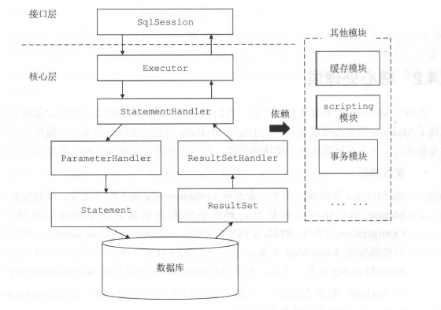

### mybatis技术内幕

1. **接口层** sqlSession
2. **核心处理层** 配置解析，参数映射，sql解析，sql执行，结果集映射，插件
3. **基础支持层** 数据源模块，事务管理模块，缓存模块，Binding模块，反射模块，类型转换，日志模块，资源加载，解析器模块



#### 基础支持层

2.1 解析器模块  
相关类(org.mybatis.ibatis.parsing)：XPathParser XNode TokenHandler PropertyParser  
GenericTokenParser 字占位符解析器：按顺序查找openToken和closeToken，解析得到占位符的字面量，交给TokenHandler处理，将解析结果 重新拼装成字符串并返回  
不仅可以用于默认值解析，也可以用于动态sql语句的解析

TokenHandler有四个实现

1. VariableTokenHandler(PropertyParser的私有静态内部类)
2. ParameterMappingTokenHandler
3. DynamicCheckerTokenParser
4. BindingTokenParser

2.2 反射工具

1. **Reflector**(缓存反射操作需要使用的类的元信息)  
   JavaBean:
   字段: 定义的成员变量 属性: 通过getter/setter得到的(只与类中的方法有关，与是否存在成员变量没有关系)  
   定义的字段：
    1. 可读/写属性的名称集合 String[]
    2. 属性相应的setter/getter方法 Map<String, Invoker> (key: 属性名称, value: 对应setter/getter方法对应Method对象的封装)
    3. 属性相应setter/getter方法的返回值类型 Map<String, Class<?>> (key: 属性名, value: setter/getter方法的返回值类型)
    4. 默认的构造方法 Constructor<?>
    5. 所有属性名称的集合

   Map<String, Invoker> getMethods = new HashMap<>();  
     
   invoke(Object target, Object[] args)  用于获取指定字段的值(getXxx)或执行指定的方法(Method.invoke())  
   getType() 返回属性相应的类型

    1. 查找默认的构造方法(无参的)
    2. addGetMethods(clazz) 处理clazz中的getter方法，填充getMethods和getTypes集合
        1. getClassMethods(clazz) 获取当前类及其父类中定义的所有方法的唯一签名 和 对应的Method对象
        2. 从上面方法中返回的数组中查找该类中定义的所有getter方法(暂时存放到conflictingGetters集合中)
        3. resolveGetterConflicts 子类覆盖父类的getter方法且返回值发生变化时，处理冲突
    5. addFields(clazz) 处理类中定义的所有字段，将处理后的字段信息添加到集合中(final static can only be set by the classloader)  
       同时提供了多个get*()方法用于读取上述集合中记录的元信息

   ReflectorFactory接口 实现对Reflector对象的创建和缓存  
   DefaultReflectorFactory  
   使用ConcurrentHashMap<Class, Reflector>完成对Reflector对象的缓存

2. **TypeParameterResolver**  
     
   java.lang.reflect.Type接口:
    1. 子接口: ParameterizedType, GenericArrayType, TypeVariable, WildcardType
        1. ParameterizedType 参数化类型 List<String>  
           Type getRawType 返回参数化类型中的原始类型List  
           Type[] getActualTypeArguments 返回类型变量或实际类型列表 String  
           Type getOwnerType 返回类型所所属类型 Map<K,V>接口是Map.Entry<K, V>接口的所有者
        2. TypeVariable 类型变量，反应在JVM编译该泛型前的信息 List<T> T就是类型变量  
           Type[] getBounds 获取类型变量的上界，为明确声明则为Object Test<T extends User> -> User  
           D getGenericDeclaration 获取声明改类型变量的原始类型 Test<T extends User> -> Test  
           String getName 获取源码中定义的名称 T
        3. GenericArrayType 表示数组类型且组成元素是ParameterizedType 或 TypeVariable  
           Type getGenericComponentType 返回数组的组成元素
        4. WildcardType 通配符泛型(<? extends Number>, <? super Integer>)  
           Type[] getUpperBounds 返回泛型变量上界  
           Type[] getLowerBounds 返回泛型变量下界
    2. 实现类: Class
        1. Class: 它表示的是原始类型。Class 类的对象表示JVM中的一个类或接口，每个Java 类在JVM里都表现为一个Class 对象。在程序中可以通过“类名.class ”、“对象.getClass()
           ”或是Class.forName(类名)等方式获取Class。**数组也被映射为Class对象，所有元素类型相同且维数相同的数组都共享同一个Class对象**

   TypeParameterResolver 提供静态方法解析指定类中的字段，方法返回值或方法参数类型  
   存在复杂继承关系以及泛型定义时，该类帮助解析字段、方法参数、或方法返回值的类型  
   resolveFieldType() 解析字段类型

3. **ObjectFactory**  
   通过多个重载的create方法创建对象
    1. 设置配置信息
    2. 通过无参构造函数创建指定对象
    3. 根据参数列表选择指定的构造函数创建对象
    4. 检测指定类型是否为集合(用来处理java.util.Collection及其子类)
       DefaultObjectFactory是唯一实现  
       instantiateClass根据传入的参数列表选择合适的构造函数实例化对象

4. **Property**工具类
    1. PropertyTokenizer Iterable 对传入的表达式进行解析 (orders[0].items[0].name)
       当前表达式，当前表达式的索引名，索引下标，子表达式
    2. PropertyNamer 完成方法名到属性名的转换(将方法名开头的is, get, set去掉并将首字母小写)
    3. PropertyCopier 完成相同类型的两个对象之间的属性值拷贝

5. **MetaClass**  
   MetaClass 构造函数是私有的，通过静态方法(forClass)创建 通过组合Reflector和PropertyTokenizer完成对复杂属性表达式的解析，并获取指定属性描述信息  
   findProperty hasGetter hasSetter  
   封装一个Reflector对象(通过ReflectorFactory创建), 类级别的元信息封装和处理

6. **ObjectWrapper**
   对象级别的元信息处理：抽象了对象的属性信息，定义一系列查询和更新对象属性信息的方法  
   get(PropertyTokenizer) // 如果封装的是普通对象，调用相应属性对应的getter方法；如果是集合，获取指定key或下标对应的value (set(PropertyTokenizer, Object value)
   设置值)  
   findProperty(String, boolean) 查找属性表达式指定的属性 (是否忽略下划线)  
   getGetter/SetterNames 查找可写/读属性的名称集合  
   getGetter/SetterType 解析属性表达式指定属性的getter的参数类型/setter方法的返回值类型  
   hasGetter/Setter 判断指定属性是否有getter/setter方法  
   instantiatePropertyValue 为属性表达式的指定属性创建相应的MetaObject对象  
   isCollection add addAll (封装对象是否是Collection集合，向集合中添加对象)

   ObjectWrapperFactory(实现类DefaultObjectWrapperFactory不可用)负责创建ObjectWrapper  
     
   BaseWrapper(处理集合)
    1. resolveCollection 解析属性表达式并获取指定的属性
    2. get/setCollectionValue 解析属性表达式的索引信息，然后获取/设置对应项

   BeanWrapper(处理bean对象)  
   MapWrapper(处理Map<String, Object>类型的对象)  
   CollectionWrapper(不可用)

7. **MetaObject**
   完成属性表达式的解析过程

2.3 **TypeHandler**类型转换  
完成Java类型 和 JDBC类型的互相转换  
用于完成单个参数以及单个列值的类型转换，如果存在多列值转换成一个java对象，应有限考虑<resultMap>  
enum JdbcType代表JDBC中的数据类型，HashMap<TYPE_CODE, JdbcType>维护常量编码和JdbcType的关系

所有的类型转换器全部继承TypeHandler

1. setParameter 通过PreparedStatement为sql语句绑定参数时，将数据从JdbcType类型转换成Java类型
2. getResult 从ResultSet中获取结果时，将数据从Java类型转换成JdbcType类型

BaseTypeHandler 实现了TypeHandler接口，对于数据非空处理都交给了子类

TypeHandlerRegistry 管理众多的TypeHandler，MyBaits初始化时，会为所有已知的TypeHandler创建对象，注册在其中

1. 记录JdbcType与TypeHandler的对应关系(用于从结果集读取数据时，将数据从Jdbc类型转换成Java类型 char, varchar -> java.lang.String)
2. 记录Java类型向指定JdbcType转换时，需要使用的TypeHandler对象(一对多 java.lang.String -> char, varchar)
3. 记录全部TypeHandler的类型 和 相应的对象
4. 一个空TypeHandler集合标识

注册TypeHandler  
通过读取(@MappedJdbcTypes(JdbcType.VARCHAR), @MappedTypes({Date.class}))两个注解的内容，注册进去 或 扫描包下的类注册进去  
查找TypeHandler  
根据指定的JavaType 和 JdbcType查找相应的TypeHandler对象

TypeAliasRegistry 完成别名注册和管理功能(管理别名和java类型之间的关系)  
registerAlias(String, Class) key转小写放入  
registerAliases(packageName, Class) 扫描指定包下的所有类，为指定类的子类添加别名  
registerAlias(Class) 尝试读取@Alias注解

2.4 日志模块  
设计模式六大原则：

1. 单一职责原则
2. 里氏替换原则
3. 依赖倒置原则
4. 接口隔离原则
5. 迪米塔法则
6. **开放封闭原则**  程序要对扩展开放，对修改关闭

适配器模式  
需要适配的类(真正的业务逻辑) <--> 适配器 <--> 目标接口(调用者使用)  
com.apache.ibatis.logging.Log 定义日志模块的功能  
LogFactory 创建对应的日志组件适配器

代理模式 与 JDK动态代理    
代理模式可以控制对真正对象的访问，或在执行业务处理的前后进行相关的预处理和后置处理，还可以用于实现延迟加载(当系统真正使用数据时，再调用 代理对象完成数据库的查询并返回数据)功能  
静态代理：编译阶段就要创建代理类  
JDK动态代理：InvocationHandler接口，动态创建代理类并通过类加载器加载，然后在创建代理对象时将InvokeHandler对象作为构造参数传入，当调用代理对象时 ，会调用InvokerHandler.invoke()
方法，并最终调用真正的业务对象的相应方法。

```text
Proxy.newProxyInstance(ClassLoader loader, Class<?> interfaces, InvocationHandler h)
loader 加载动态生成的代理类的类加载器
interfaces 业务类实现的接口
h 实现InvocationHandler的对象

业务逻辑(java.lang.reflect.Proxy类中):
 1. 获取代理类的Class getProxyClass0(loader, interfaces)
   1. 限制接口数量 < 65536
   2. 如果指定的类加载器中已经创建了实现指定接口的代理类，就从缓存(WeakCache<ClassLoader, Class<?>[], Class<?>> proxyClassCache)中查找；否则通过ProxyClassFactory创建实现指定接口的代理类
   3. WeakCache.get先从缓存中查找代理类，如果找不到创建Factory(WeakCache的内部类)对象调用get方法获取代理类，Factory.get会调用ProxyClassFactory.apply(Proxy类中，是一个BiFunction<T, U, R>(提供两个参数，返回一个结果))创建并加载代理类
   4. apply方法先检测代理类需要实现的接口集合，确定代理类的名称，创建代理类并写入文件，最后加载代理类返回对应的Class对象用于后续实例化代理类对象
 2. 获取代理类的构造方法
 3. 创建代理对象
```

JDBC调试  
com.apache.ibatis.logging.jdbc包通过动态代理的方式将JDBC操作通过指定的日志框架打印出来  

BaseJdbcLogger ConnectionLogger 封装Connection对象同时为其封装的Connection对象创建相应的代理对象  
PreparedStatementLogger 封PreparedStatement对象，并为其创建相应的代理对象  
StatementLogger  
ResultLogger 封装ResultSet对象并为其创建代理对象 (展示查询结果)

2.5 资源加载  
org.apache.ibatis.io包封装ClassLoader以及读取资源文件的API  
ClassLoaderWrapper是ClassLoader包装器，确保返回给系统的时正确的加载器(安装指定的顺序依次检测封装的ClassLoader对象，从中选择一个可以的完成相关功能)  
包含 系统指定的默认加载 和 系统类(应用程序类)加载器  
类加载器顺序 [参数指定的类加载器，系统值的默认加载器，当前线程绑定的类加载器，加载当前类使用的类加载器，系统类加载器]  
Resources 调用封装的ClassLoaderWrapper返回数据  
ResolverUtil 根据指定条件查找指定包下的类  
条件Test(只有一个matches<Class>方法, IsA(检测类是否继承类指定类或接口) AnnotatedWith(检测类是否添加了指定注解))，类中封装了当前使用的类加载器(默认时当前线程上下文绑定的ClassLoader(Thread.currentThread().getContextClassLoader()))  
单例模式(volatile禁止指令重排序；第一次访问类中的静态字段时，会触发类的加载)  
VFS 虚拟文件系统 查找指定路径下的资源，包括jar包

2.6 DataSource  
实现javax.sql.DataSource接口  
PooledDataSource 和 UnpooledDataSource 使用工厂创建  
工厂方法模式：添加新产品时，只需要添加对应的工厂实现类，而不必修改已有的代码。符合开放封闭原则。同时工厂方法先调用者隐藏具体产品的实例化细节 调用者只需要了解工厂接口和产品接口，面向接口编程。  
但是新增新产品实现类时，还要提供一个与之对应的工厂实现类，新增的类是成对实现的。

org.apache.ibatis.datasource.DataSourceFactory 工厂接口(配置属性，获取数据源)  
UnpooledDataSourceFactory, PooledDataSourceFactory 两个工厂接口实现类  
  
javax.sql.DataSource 产品接口  
UnpooledDataSource, PooledDataSource 两个产品类

1. UnpooledDataSource 每次getConnection都会获取一个新的连接
2. PooledDataSource  
   使用PooledConnection封装代理(Jdk动态代理，对close方法进行代理)真正的Connection对象(真正的Connection对象是由封装的UnpooledDataSource创建的)    
   PolledDataSource封装数据库连接池的统计信息  
   使用PoolState管理PooledConnection对象的状态，分别用List存储 空闲和活跃状态的连接，并存储一些关于连接池的统计字段  
   使用线程池 调用代理对象的close方法时，并未真正关闭数据库连接，而是将PooledConnection对象归还给数据库，供之后重用  
   PooledDataSource.getConnection的时候会获取PooledConnection对象，然后getProxyConnection获取数据库连接的代理对象  
   修改数据库配置的时候，会清空所有的连接

2.7 Transaction  
org.apache.ibatis.transaction.Transaction 接口  
  
JdbcTransaction JdbcTransactionFactory 依赖Jdbc Connection控制事务的提交和回滚  
ManagedTransaction ManagedTransactionFactory 依赖容器控制事务的提交回滚  
TransactionFactory 在指定连接上创建事务对象 或 从指定数据源中获取数据库连接，在连接上创建事务对象

2.8 Binding模块

MapperRegistry MapperProxyFactory  
MapperRegistry 是Mapper接口及其对应的代理对象工厂的注册中心 记录Mapper接口 和 MapperProxyFactory之间的关系  
在Mybatis初始化时，会读取配置文件以及Mapper接口中的注解信息填充到knownMappers里面，  
Map<Class, MapperProxyFactory> knowMappers = new HashMap<Mapper接口对于的Class对象, MapperProxyFactory工厂对象，为Mapper接口创建代理对象>()  
MapperProxyFactory负责创建代理对µ象

MapperProxy  
实现类InvocationHandler接口，为接口(@Mapper)创建代理对象

**MapperMethod(记录sql语句信息)**  
封装Mapper接口中对应方法的信息，以及对应的sql语句信息。可以在多个代理对象之间共享  
一个连接Mapper接口和映射配置文件中定义的sql语句的桥梁  
execute根据sql语句类型(insert, update...)完成数据库操作并处理返回值(Bean, Map, List, [], void...)

SqlCommand(内部类)

1. name记录sql语句的名称(接口名.方法名)
2. type记录sql语句类型(unknown, select, insert, update, delete, flush)

**ParamNameResolver**  
处理Mapper接口中定义的方法的参数列表  
SortedMap<Integer, String> names 记录参数列表中的**位置索引**和**参数名称/参数索引**之间的对应关系(第key个位置是第value个参数)  
RowBounds 和 ResultHandler不会被记录  
将实参与对应的名称进行关联 Map<String, Object> param {{0, val1}, {param1, val2}, {1, val2}, {param2, val2}}

```text
aMethod(@Param("M") int a, @Param("N") int b) -> {{0, "M"}, {1, "N"}}
aMethod(int a, int b) -> {{0, "0"}, {1, "1"}}
aMethod(int a, RowBounds rb, int b) -> {{0, "0"}, {2, "1"}}
```

MethodSignature(内部类)  
封装Mapper接口中定义的方法的相关信息  
返回值是否为Collection, Map, void, Cursor; 返回值类型  
如果返回map，记录key的名字  
记录RowBounds, ResultHandler的位置  
记录该方法对应的ParamNameResolver对象

2.9 缓存 org.apache.ibatis.cache.Cache接口  
装饰器模式: 动态的为对象添加功能，基于组合的方式实现  
Cache定义(缓存对象id, 向缓存中加数据, 根据指定key查找缓存项, 删除key对应的缓存项, 清空缓存, 获取缓存个数)  
Cache中唯一确定一个缓存项是通过缓存项中的key, 使用CacheKey表示(封装多个影响缓存项的因素)

PerpetualCache提供了基本实现，被装饰器装饰的原始对象，其他高级功能通过装饰器添加到该类上面  
通过HashMap记录缓存项

org.apache.ibatis.cache.decorators 提供各种装饰器，在PerpetualCache基础上提供额外功能  
通过组合完成特定的需求

BlockingCache保证只有一个线程到数据库中查找指定key对应的数据  
每个key都有一个ReentrantLock；线程A在BlockingCache中未查找到keyA对应的缓存项时，线程A会获取keyA对应的锁，后续线程在查找keyA时会发生阻塞  
线程A从数据库中查到keyA对应的结果后，将结果对象放入BlockingCache里面，释放锁，唤醒阻塞在该锁上的线程  
其他线程可以从BlockingCache中获取数据，不需要重新访问数据库

FifoCache LruCache按照一定的规则清理缓存  
FifoCache 向缓存中添加数据(Deque LinkedList)时，如果缓存项的个数达到上限，会将缓存中最早进入的缓存项删除  
LruCache 清空最近最少使用的缓存项(LinkedListHashMap)  
SoftCache WeakCache  
ScheduledCache 周期性清理缓存(默认一小时，清空所有缓存项)  
LoggingCache 提供日志功能 记录命中次数和访问次数，统计命中率  
SynchronizedCache 用synchronized为Cache添加同步功能

以上从缓存中获取同一key对应的对象都是**同一个**，任意一个线程修改后都会影响到其他线程获取的对象

SerializedCache 提供将value对象序列化功能，将序列化后的byte[]作为value存储缓存，取出时反序列化，所以每次获取到的都是新的对象

CacheKey 缓存中的key  
可以添加多个对象(存入updateList)，共同决定两个key是否相同

1. MapperStatement的id
2. 指定查询结果集的范围 RowBounds.offset RowBounds.limit
3. 查询所使用的sql语句，boundSql.getSql()返回的sql语句，可能包含?占位符
4. 用户传递给上述sql的实际参数值

#### 核心处理层

3.1 MyBatis初始化

1. 读取 mybatis-config.xml 和 XxxMapper.xml配置文件
2. 加载配置文件中指定的类，处理类中的注解，创建一些配置对象

建造者模式: 将复杂对象的构建过程和表示分离，同样地构建过程可以创建不同的表示

BaseBuilder 接口 定义构造者构造产品对象的各部分行为  
  
初始化入口 SqlSessionFactoryBuilder.build()

org.apache.ibatis.session.Configuration 初始化过程中创建且全局唯一，MyBatis初始化的核心对象  
XMLConfigBuilder 负责解析mybatis-config.xml配置文件

```text
properties, settings, typeAliases, typeHandlers, objectFactory, objectWrapperFactory, reflectorFactory, plugins, environments, databaseIdProvider, mappers
```

**XMLMapperBuilder** 负责解析映射配置文件(XxxMapper.xml)  
**MapperAnnotationBuilder**

```text
cache-ref cache resultMap sql select|insert|update|delete
```

解析cache cache-ref  
MapperBuilderAssistant 负责创建Cache对象，添加到Configuration.cache(StrictMap<namespace, cache>)中  
Ambiguity 存在二义性的键值对  
CacheBuilder 负责建造Cache

解析resultMap(定义结果集和结果对象之间的映射规则)  
ResultMap 每一个<resultMap>标签被解析成一个ResultMap  
ResultMapping 记录结果集中的一列和JavaBean中的一个属性之间的映射关系

**XMLStatementBuilder** 负责解析sql节点语句  
SqlSource 表示映射文件 或 注解中定义的sql语句(可能包含动态sql，占位符)  
getBoundSql(args) 根据映射文件或注解的sql + 传入的参数返回可执行的sql  
MappedStatement 表示映射文件中定义的sql节点  
解析include sql  
XMLIncludeTransformer 解析sql语句中的<include>标签(将<include>标签替换成<sql>中定义的片段，并将其中的${xxx}占位符替换成真实的参数)

解析selectKey  
将<include>和<selectKey>节点解析并删除掉  
解析sql节点，添加到Configuration.mappedStatements集合中保存

绑定Mapper接口  
每个映射文件的命名空间可以绑定一个Mapper接口，并注册到MapperRegistry中  
XMLMapperBuilder.bindMapperForNamespace方法 完成映射文件和对于Mapper接口的绑定

解析配置文件是按照文件从头到尾按顺序解析的，如果再解析某一个节点时，引用到了定义在之后的节点，会抛出IncompleteElementException  
根据抛出异常的节点不同放到不同的集合(incomplete*)中

3.2 SqlNode SqlSource  
映射配置文件中的sql节点会被解析成MappedStatement  
sql语句被解析成SqlSource对象(其中定义动态sql节点，文本节点)，通过解析得到BoundSql对象  
  
RawSqlSource: 负责处理静态语句  
DynamicSqlSource: 负责处理动态sql语句，封装的sql需要进行一系列的解析，才能形成数据库可执行的sql  
上面两种都会将处理好的sql语句封装成StaticSqlSource返回  
StaticSqlSource: 记录的sql可能包含占位符，但是可以直接交给数据库执行

采用组合的设计模式处理动态sql节点，解析成SqlNode，形成树形结构  
OGNL(object graphic navigation language 对象图导航语言)表达式  
存取java对象树中的属性，调用java对象树中的方法等

DynamicContext  
记录解析动态sql语句之后产生的sql语句片段，一个用于记录动态sql语句解析结果的容器，当sql中的所有节点解析完成后，可以从中获取一条动态生成的sql语句  
SqlNode 解析对应的动态sql节点  


SqlSourceBuilder

1. 解析sql语句中的占位符(#{__frc_item_0, javaType=int, jdbcType=NUMERIC, typeHandler=MyTypeHandler.class})定义的属性
2. 将sql语句中的占位符替换成?

ParameterMappingTokenHandler 解析#{}占位符中的参数属性 以及替换占位符  
ParameterMapping 记录#{}占位符中的参数属性  
**BoundSql** 记录sql语句 和 参数

DynamicSqlSource 负责解析动态sql语句  
SqlSourceBuilder

RawSqlSource

XmlScriptBuilder中判断sql节点是否为动态的  
如果某个节点只包含${}占位符，不包含动态sql节点或未解析的${}占位符，则不是动态语句 创建 StaticSqlSource 对象  
如果整个节点不是动态的sql节点，创建 RawSqlSource 对象

3.3 ResultSetHandler  
StatementHandler接口在执行完指定的select语句之后，将查询到的结果交给ResultSetHandler完成映射处理 或 处理存储过程执行后的输出参数  
DefaultResultSetHandler 是唯一实现  


